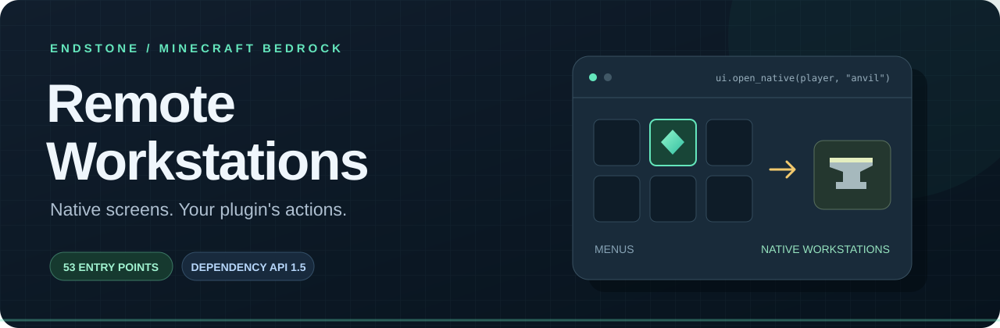
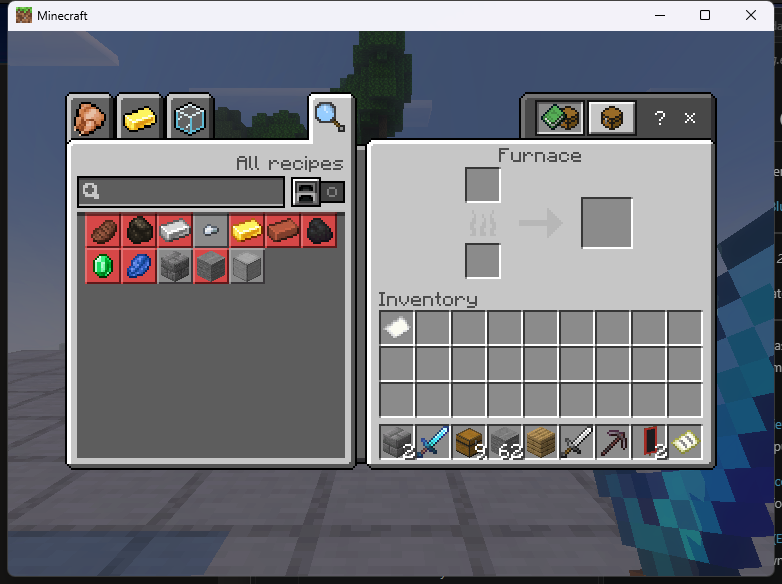

<p align="center"></p>

<p align="center">
  <a href="https://github.com/TheNINJALLO/endstone-remote-workstations/releases/latest"></a>
  
  
  <a href="LICENSE"></a>
</p>

<p align="center"><b>Open familiar Minecraft screens. Build the plugin experience around them.</b><br>Real workstations, real source inventories, custom menus and named server callbacks.</p>

**Development branch:** `0.5.0.dev1` begins [held-item inspection and journal work](docs/HELD_ITEMS.md).
Held-item UIs remain disabled. The current published release is **0.4.0 / API 1.5**;
the release features and downloads below describe that version.

<p align="center">
  <a href="https://github.com/TheNINJALLO/endstone-remote-workstations/releases/latest"><b>Download</b></a> ·
  <a href="docs/INSTALLATION.md">Installation</a> ·
  <a href="docs/EXAMPLES.md">Developer examples</a> ·
  <a href="https://github.com/TheNINJALLO/endstone-remote-workstations/wiki">Wiki</a> ·
  <a href="docs/SUPPORT.md">Compatibility & scope</a>
</p>

---

## A UI toolkit with native workstations

RemoteWorkstations is an Endstone plugin and a dependency for other plugins.
It exposes **53 implemented entry points** across native workstations, linked
containers, entity inventories, editors, NPC dialogue and the real Ender Chest.
BDS runs native recipes, validates native item requests and owns native source
inventories, metadata and XP.

Build navigation with ordinary forms or protected inventory-slot menus. Buttons
call your registered functions, open another page, or hand control to a supported
native screen. Your plugin supplies custom recipe or enchantment logic;
RemoteWorkstations supplies the UI and lifecycle API.

<table>
  <tr>
    <td width="50%"><br><b>Your menu and actions</b><br>Protected icons, pages and exported callbacks.</td>
    <td width="50%"><br><b>Native workstations</b><br>BDS retains item and recipe handling.</td>
  </tr>
  <tr>
    <td><br><b>The actual Ender Chest</b><br>The online player's existing inventory.</td>
    <td><br><b>Real sources</b><br>Storage and processing follow the loaded world.</td>
  </tr>
</table>

Unaltered screenshots from the final 0.4.0a24 qualification run.
[Validation](docs/VALIDATION.md) explains their relationship to release 0.4.0.

## Choose your download

| Package | What you get |
| --- | --- |
| **Windows x86-64, CPython 3.11** — `endstone_remote_workstations-0.4.0-cp311-cp311-win_amd64.whl` | Python API and the native Windows companion. The full implemented catalog is available subject to configuration, permissions and world features. |
| **Portable Python** — `endstone_remote_workstations-0.4.0-py3-none-any.whl` | Python API, forms, actions and catalog; **no native companion**. Use this for Linux evaluation. Linux runtime and packet-screen behavior are unqualified. |
| **Optional example** — `endstone_rw_ui_example-0.2.0-py3-none-any.whl` | A separate consumer providing `/uidemo` and `/uidemo inventory`. |

Install **one** RemoteWorkstations wheel. A portable wheel is not a Linux native
workstation implementation. Native screens require **Endstone 0.11.10 / BDS
1.26.45.1 / protocol 2169**, CPython 3.11 and the admitted **Windows Bedrock
1.26.45** client. The native companion checks actual server/runtime hashes.

## Start in a few steps

1. Put the matching wheel into your Endstone server's `plugins/` folder.
2. Start once to generate `plugins/remote_workstations/config.toml`, then stop.
3. In that existing file, enable the backends you intend to use:

   ```toml
   [native]
   enabled = true

   [packet_inventory]
   enabled = true
   ```

4. Restart, join with the admitted client and try `/workstations`, `/craft`, `/anvil` or `/ec`.
5. For the demo, add the optional example wheel and run `/uidemo inventory`.

Runtime codecs are pinned to `bstream==1.0.1` and `rapidnbt==1.3.5`.
[Installation](docs/INSTALLATION.md) covers dependencies, upgrades and Linux
scope. Real block/entity sources and privileged editors require additional
explicit settings. Gameplay backends start disabled.

## Add it as a dependency

```python
from endstone.plugin import Plugin
from endstone_remote_workstations.api import Button, Menu, get_api

class MyPlugin(Plugin):
    api_version = "0.11"
    depend = ["remote_workstations"]

    def on_enable(self):
        self.ui = get_api(self, minimum=(1, 5))

    def show_workshop(self, player):
        return self.ui.show_menu(player, Menu("Your workshop", (
            Button("Crafting table", "native:craft"),
            Button("Anvil", "native:anvil"),
        )))

    def on_disable(self):
        self.ui.dispose()
```

Call `show_workshop(player)` from your command or event handler on the server
thread. Native permissions and configuration still apply.

**[Explore the examples →](docs/EXAMPLES.md)**
Native screens · Ender Chest · protected inventory menus · exported actions ·
linked blocks · entity sources · NPC dialogue · lifecycle handling.

## What's in the catalog?

| Family | Entry points / behavior |
| --- | --- |
| Native workstations | Crafting, anvil, stonecutter, grindstone, smithing, loom, cartography |
| Player inventory | Inventory, armor, offhand and recipe-book entry points into the shared native screen |
| Linked containers | Chest variants, barrel, hopper, dispenser/dropper, furnaces, brewing, enchanting, beacon, crafter and lectern |
| Entity sources | Chest vehicles, horse-family equipment, camel/nautilus variants, merchants and the owned Agent |
| World editors | Sign, jigsaw, command block/cart and structure editors; separately enabled privileged capabilities |
| Education / dialogue | Four chemistry tables and native NPC dialogue, with real world/source requirements |
| Developer UIs | Forms, 27-slot protected icon menus, named/exported callbacks and online Ender Chest access |

Use `/workstations list` or `ui.capabilities(player)` for availability details.
[Full catalog](docs/CAPABILITIES.md) · [Commands and permissions](docs/COMMANDS.md)

## Release scope

**0.4.0 is a regular release of the implemented feature set.** Held shulker,
bundle and book interfaces are not implemented. Exactly-once crash recovery is
not provided. Privileged native editors retain separate opt-ins and incomplete
hardware shadow-stack/exception-path qualification; command-cart prefill is a
known limitation. Multiplayer, other devices and Linux native execution are
outside the tested scope.

The final alpha passed 565 automated tests, all 53 implemented UI lifecycle
checks, 95 console checks, eight mounted-merchant cases and seven dependency
integration checks. Release validation distinguishes that evidence from tests
run on the final 0.4.0 wheels. See [validation](docs/VALIDATION.md) and
[support boundaries](docs/SUPPORT.md).

## Documentation

| For server owners | For developers |
| --- | --- |
| [Installation & upgrades](docs/INSTALLATION.md) | [Examples](docs/EXAMPLES.md) |
| [Commands & permissions](docs/COMMANDS.md) | [Dependency API 1.5](docs/DEVELOPER_API.md) |
| [Source configuration](docs/LINKED_BLOCKS.md) | [Entity contexts](docs/LINKED_ENTITIES.md) |
| [Troubleshooting](docs/TROUBLESHOOTING.md) | [Native build guide](docs/BUILDING.md) |
| [Support & limitations](docs/SUPPORT.md) | [Contributing](CONTRIBUTING.md) |

## License

Original code is [MIT](LICENSE). The optional Chest-UI encoding port retains
CC BY 4.0 attribution; dependencies have their own notices.
See [third-party notices](THIRD_PARTY.md). Server executables, worlds and private
test captures are excluded. [Image credits](docs/assets/README.md).

Minecraft is a trademark of Mojang and Microsoft. This community project is
not an official Minecraft product.
