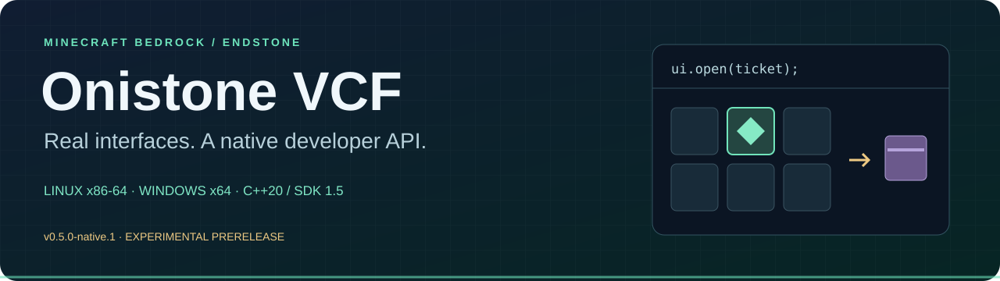

# Onistone Virtual Container Framework

Native Minecraft Bedrock interfaces for Endstone, with a C++20 implementation, a versioned C ABI and standalone example plugins. Linux x86-64 is the primary target; Windows x64 has its own DLL and native adapter.

**v0.5.0-native.1 is an experimental prerelease for isolated testing.** The complete 69-entry native/custom migration remains in progress. A catalog entry, successful build or selected client test does not establish full product qualification.

[Download](https://github.com/TheNINJALLO/endstone-remote-workstations/releases/tag/v0.5.0-native.1) · [Install](docs/NATIVE_INSTALLATION.md) · [Examples](docs/NATIVE_EXAMPLES.md) · [SDK](docs/NATIVE_SDK.md) · [Documentation](docs/README.md) · [Wiki](https://github.com/TheNINJALLO/endstone-remote-workstations/wiki)

## What you can try

| Feature | Linux server | Windows server |
| --- | --- | --- |
| SDK 1.5, forms, actions and permission guards | Implemented; selected stock-client evidence | Built; earlier server-load evidence |
| Original workstations and player inventory roles | Eight contexts and four shared roles have selected PC evidence | Seven contexts and four roles have an experimental adapter; current gameplay qualification incomplete |
| Real linked storage, machines and utilities | Fourteen source entries have selected PC evidence | Unavailable |
| Actual held shulker contents | Experimental editor with journaled transfers and durable item ID | Unavailable |
| Complete saved-item reads, observations and guarded writes | Implemented; selected metadata and crash checks | Native writer unavailable |
| Custom inventory recipes and remaining catalog families | Incomplete | Incomplete |

The linked Linux entries are `chest`, `trappedchest`, `doublechest`, `enderchest`, `barrel`, `hopper`, `dispenser`, `dropper`, `furnace`, `blastfurnace`, `smoker`, `brewing`, `beacon` and `crafter`. Each requires its documented source and permissions.

The held editor uses the selected actual shulker and preserves complete saved metadata. Existing stones and a named enchanted pickaxe have been transferred through the real screen. Forced closure cancelled an unfinished cursor operation, and completed inventory survived a clean restart. Bundle editing, full nesting/lifecycle qualification and automatic BDS/plugin save reconciliation remain incomplete. [Read the contract](docs/NATIVE_HELD_STORAGE.md).


## Install

Choose the Linux `.so` or Windows `.dll` provider archive. SDK, examples and debug symbols are separate downloads. The native framework is not a wheel.

The admitted target is Endstone **0.11.10**, BDS **1.26.45.1**, protocol **2169**, with the documented Windows Bedrock **1.26.45** client profile. Exact native runtime hashes are checked. Linux requires compatible libc++20/libc++abi20, libunwind and OpenSSL 3 libraries. Other runtime builds and Onistone binaries have not been qualified. [Linux/Pterodactyl and Windows instructions](docs/NATIVE_INSTALLATION.md).

Native inventory adapters and writes are disabled by default. After restart, surviving inventory edits require explicit recovery review; a journal acknowledgement alone does not prove BDS disk durability.

## Use the public SDK

```cmake
find_package(OnistoneVCF 1.5 CONFIG REQUIRED)
target_link_libraries(MyPlugin PRIVATE OnistoneVCF::sdk)
```

```cpp
// Keep this client alive while your consumer plugin is enabled.
oni::vcf::sdk::Client ui(oni::vcf::sdk::discover(), "my_plugin");
auto ticket = ui.prepare(player_uuid, "shulker", VCF_REAL_SOURCE);
ui.open(ticket); // asynchronous: observe session state or register a callback
```

Declare `depend = {"onistone_vcf"}` and call on the server thread. This example needs the Linux held-storage/write flags, permissions and an actual shulker selected in the hotbar. [Runnable examples](docs/NATIVE_EXAMPLES.md) explain callbacks, refusals and cleanup.

## Evidence and scope

- [Prerelease contents and limitations](docs/RELEASE_NATIVE_0_5_0.md)
- [Capability matrix](docs/CAPABILITY_MATRIX.md) and [all-entry examples](docs/ALL_UI_EXAMPLES.md)
- [Inventory writes](docs/NATIVE_INVENTORY_WRITES.md) and [six-boundary BDS crash evidence](docs/NATIVE_INVENTORY_CRASH_TESTS.md)
- [Build and sanitizer instructions](docs/NATIVE_BUILDING.md)
- [Frozen migration scope](docs/ALL_UI_MIGRATION.md)

Stable [RemoteWorkstations v0.4.0](https://github.com/TheNINJALLO/endstone-remote-workstations/releases/tag/v0.4.0) remains available with its [versioned legacy documentation](https://github.com/TheNINJALLO/endstone-remote-workstations/blob/v0.4.0/README.md). Its Python APIs and feature claims do not apply to this native rewrite. Install the implementations in separate server instances.

MIT licensed. See [LICENSE](LICENSE), [NOTICE](NOTICE) and [dependency notices](licenses/).
