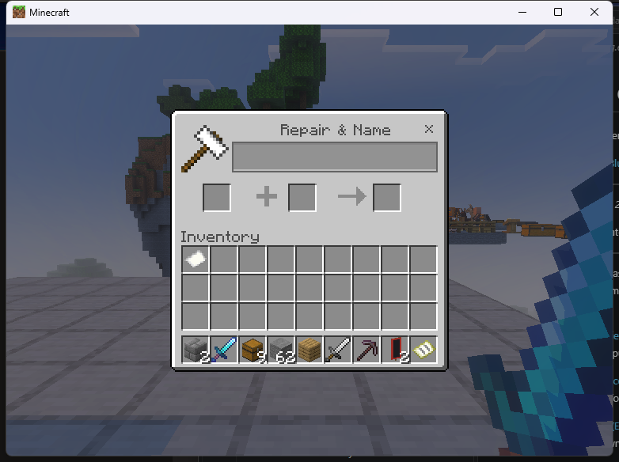
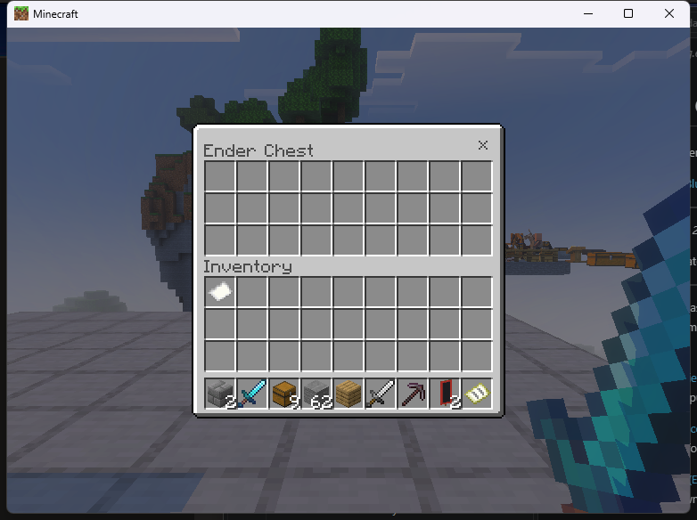
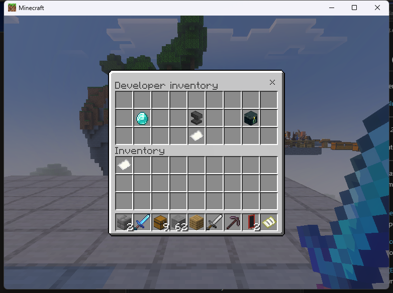
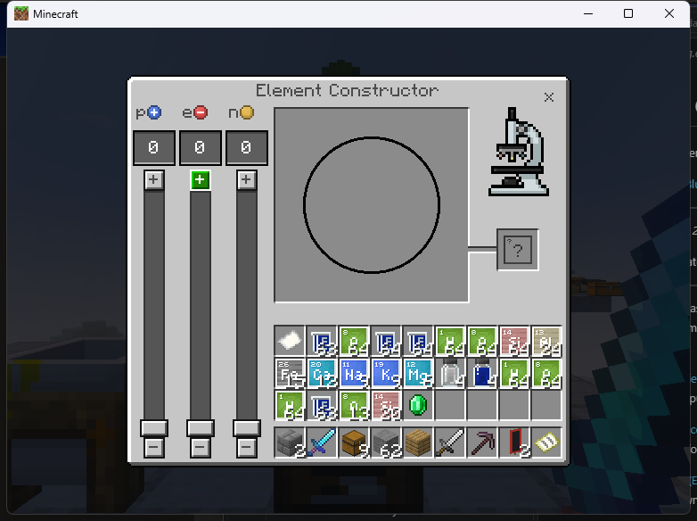

# Developer examples

[Home](../README.md) · [API reference](DEVELOPER_API.md) · [Runnable demo](../examples/dependency_plugin/README.md)

Use the public API from the Endstone game thread. Declare
`depend = ["remote_workstations"]` in your Plugin class and acquire the API in
`on_enable`. Register any permissions used by your plugin in its Endstone metadata.

```python
from endstone.plugin import Plugin
from endstone_remote_workstations.api import get_api

class Workshop(Plugin):
    api_version = "0.11"
    depend = ["remote_workstations"]

    def on_enable(self):
        self.ui = get_api(self, minimum=(1, 5))

    def on_disable(self):
        self.ui.dispose()
```

The following methods belong to that class unless stated otherwise. Invoke them
from your own command or event handler with a connected player. Closing a screen
does not undo native crafting, trades, commands or world edits already accepted.

## 1. Open a native workstation

```python
def open_anvil(self, player):
    return self.ui.open_native(player, "anvil", on_close=self.ui_closed)

def ui_closed(self, info):
    if info.state == "failed":
        self.logger.warning(f"UI unavailable: {info.reason}")
```

Use `craft`, `anvil`, `stonecutter`, `grindstone`, `smithing`, `loom` or
`cartography`. `inventory2x2`, `armor`, `offhand` and `recipebook` enter the same
native player inventory; they are not four independent client screens.



## 2. Open the player's actual Ender Chest

```python
def open_ender(self, player):
    return self.ui.open_ender_chest(player, on_close=self.ui_closed)
```

Requires `[packet_inventory] enabled = true` and the player's permissions.
This accesses the existing online Ender Chest. It does not create a separate vault.



## 3. Build a form that opens native screens

```python
from endstone_remote_workstations.api import Button, Menu

def show_stations(self, player):
    return self.ui.show_menu(player, Menu("Workshop", (
        Button("Crafting table", "native:craft"),
        Button("Anvil", "native:anvil"),
        Button("Loom", "native:loom"),
    ), content="Choose a workstation."))
```

The provider closes the selected menu generation before dispatching the action.
Native actions retain normal permissions, protection checks and configuration.

## 4. Build a protected inventory menu

Register your own actions once in `on_enable`, after obtaining `self.ui`:

```python
self.ui.register_action("choose_recipe", self.choose_recipe,
                        permission="workshop.use", export=True)
self.ui.register_action("ender", lambda ctx: self.ui.open_ender_chest(ctx.player),
                        permission="workshop.use")
```

Then add the methods:

```python
from endstone.inventory import ItemStack
from endstone_remote_workstations.api import InventoryMenu, SlotButton

def show_inventory(self, player):
    return self.ui.show_inventory(player, InventoryMenu("My workshop", (
        SlotButton(10, ItemStack("minecraft:diamond"), "choose_recipe"),
        SlotButton(13, ItemStack("minecraft:anvil"), "native:anvil"),
        SlotButton(16, ItemStack("minecraft:ender_chest"), "ender"),
    ), permission="workshop.use"))

def choose_recipe(self, context):
    context.player.send_message("Recipe selection belongs to my plugin.")
    return "selection-opened"
```

Slots are zero-based **0–26**. These items are protected button icons. Players
cannot withdraw them as rewards. Your callback can open a selection menu and call
your own recipe/enchantment service. RemoteWorkstations does not implement a
custom recipe registry or custom enchantment engine.



For pagination, register a second-page action whose callback calls
`show_inventory` with the next `InventoryMenu`. A selected button closes its old
menu before invoking that callback. The [complete demo source](../examples/dependency_plugin/src/endstone_rw_ui_example/__init__.py)
implements two pages and native/Ender transitions.

## 5. Export a function for other plugins

With the `export=True` registration above, another plugin can invoke
`workshop:choose_recipe` if the owning plugin's actual Endstone name is `workshop`:

```python
future = self.ui.invoke(player, "workshop:choose_recipe")

def completed(result):
    try:
        value = result.result()  # Already done: this is the completion callback.
        self.logger.info(f"Recipe selector returned {value}")
    except Exception as error:
        self.logger.warning(f"Recipe selector failed: {error}")

future.add_done_callback(completed)
```

Never block the game thread waiting for an unfinished Future. `ui.actions()`
lists your own registrations and other plugins' explicit exports. Private
actions are hidden and cannot be invoked by another consumer. Permission checks
run at execution time.

## 6. Link to a real loaded block

```python
from endstone_remote_workstations.api import BlockContext

def open_furnace(self, player):
    source = BlockContext("Overworld", (0, 64, 0), permission="workshop.furnace")
    return self.ui.open_linked(player, "furnace", source, on_close=self.ui_closed)
```

Replace the coordinates with a real server-authorized furnace. Enable `[native]`
and `[native.linked]`; grant both the source permission and normal UI permissions.
The player and source must meet the dimension/admission rules. Processing follows
the actual loaded source; closing the UI does not pause the world's furnace.
Never construct a context from unchecked player-supplied coordinates.

Use [the catalog](CAPABILITIES.md) for chest, hopper, brewing, beacon, crafter
and other linked IDs. No hidden station blocks are placed.

## 7. Use a real entity source

```python
from endstone_remote_workstations.api import EntityContext

def open_horse(self, player, horse):
    source = EntityContext(player.dimension.name, horse,
                           permission="workshop.horse")
    return self.ui.open_entity(player, "horse", source, on_close=self.ui_closed)
```

`horse` is an actual server-resolved Actor, with type, owner and access validated
before calling this helper. Enable `[native.entities]`. BDS retains inventory
and equipment state. Merchants use their actual offers and stock. Actor IDs from
another world are not valid source configuration. See [entity contracts](LINKED_ENTITIES.md).

## 8. NPC dialogue and world editors

```python
def show_npc(self, player, npc):
    context = EntityContext(player.dimension.name, npc,
                            permission="workshop.dialogue")
    return self.ui.open_npc(player, context, scene="welcome",
                            branches=("next_scene",), on_close=self.ui_closed)

def edit_sign(self, player):
    context = BlockContext("Overworld", (0, 64, 2), permission="workshop.sign")
    return self.ui.open_sign(player, context, front=True, on_close=self.ui_closed)
```

The NPC and its scenes must already exist in the world/behavior pack. Native
scene commands execute with their actual BDS behavior. Sign editing needs the
separate sign opt-in. Command block/cart, structure and jigsaw interfaces require
their individual opt-ins and privileged native admission. Read the editor
limitations in [support](SUPPORT.md) before enabling them.

Chemistry uses `open_linked` with `compoundcreator`, `elementconstructor`,
`materialreducer` or `labtable`, matching real blocks, Education features and
the chemistry opt-in. Agent access uses `open_entity(player, "agent", context)`
with the existing native owner and Agent opt-in.



## 9. Check availability and manage cancellation

```python
def available_stations(self, player):
    return tuple(row for row in self.ui.capabilities(player) if row["available"])

def cancel_request(self, ticket):
    if not ticket.info.done:
        ticket.cancel()
```

Contextual interfaces still need an authorized real source at open time.
Use `on_close` to inspect terminal states (`closed`, `cancelled`, `failed`).
`dispose()` revokes registrations and cancels the consuming plugin's views.
For player-inventory entry points, cancellation releases tracking; the player
closes that client-owned screen normally before another native UI can open.
