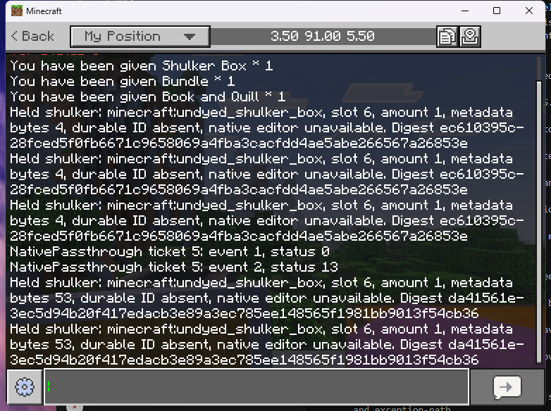
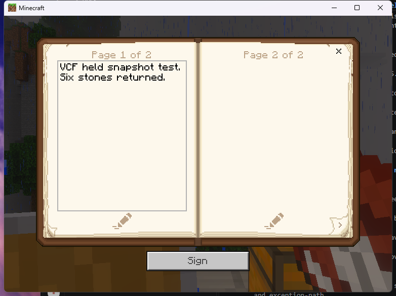
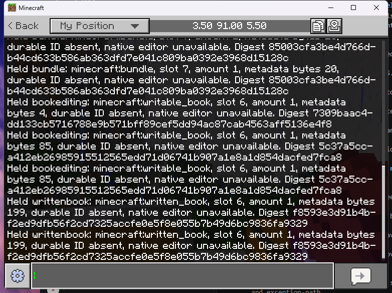
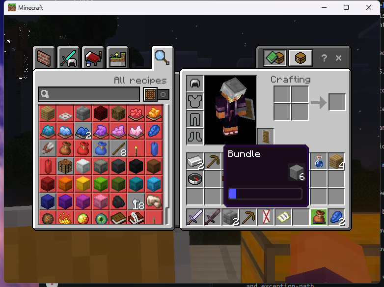
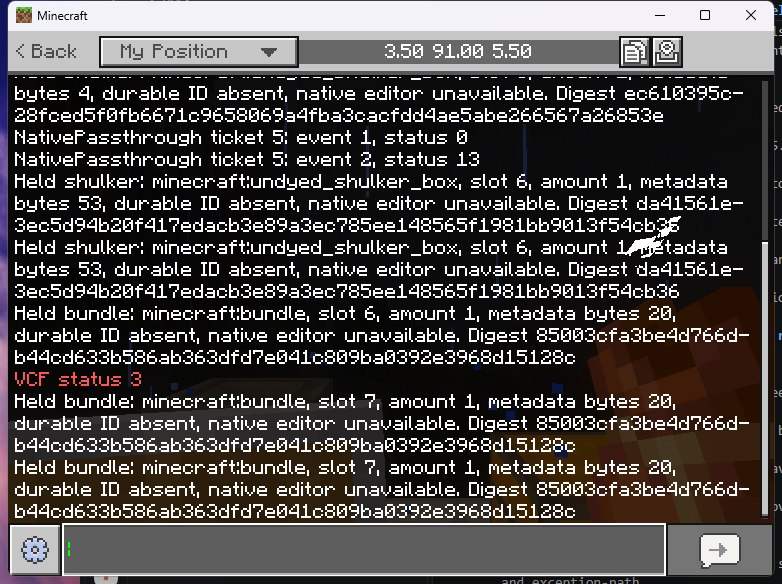
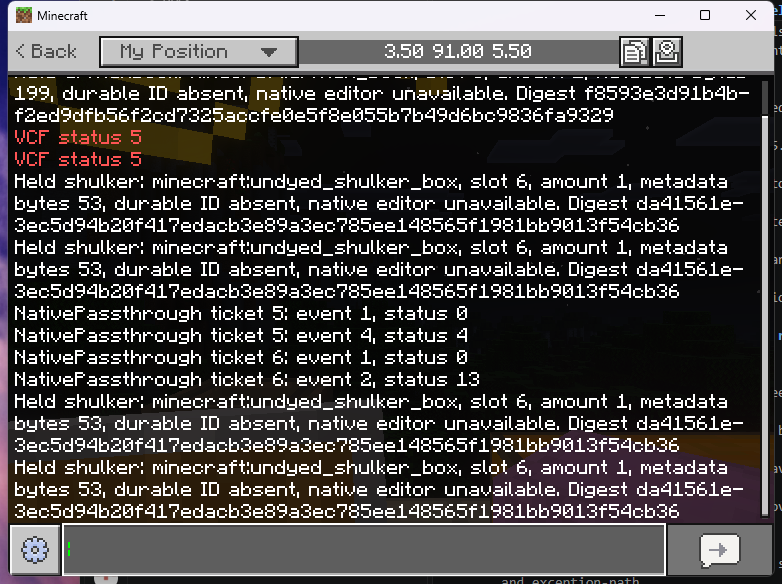
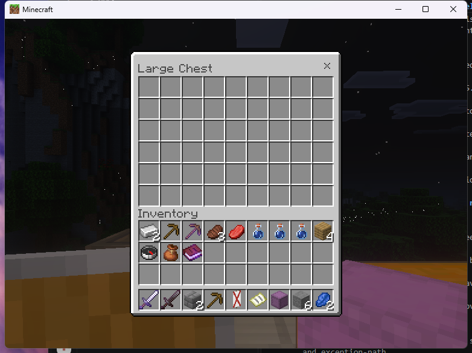
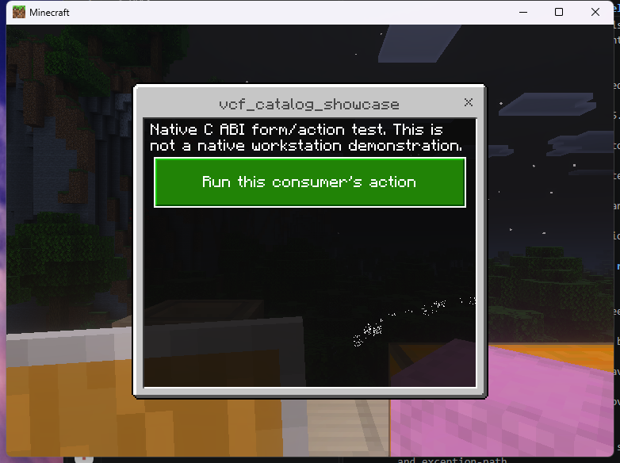
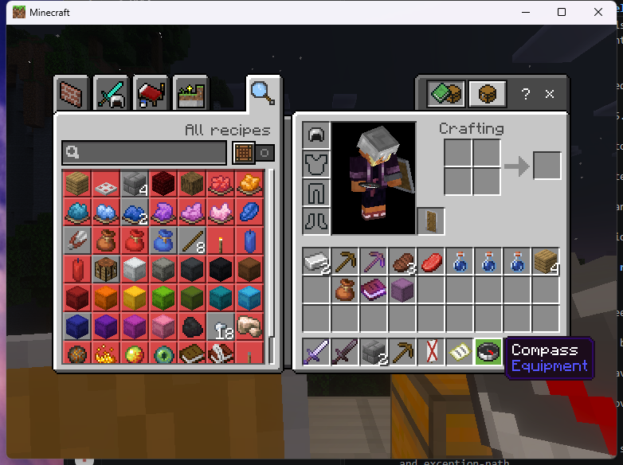

# Native held-item inspection

SDK 1.2 introduces `inspect_held` for a connected player's selected hotbar item.
This ports the read-only inspection portion of the held-item contract to C++.
Native held editors, item locking, identity assignment, writeback and crash/save
reconciliation remain incomplete. `native_open_available` is always zero.
A placed shulker block is not a substitute for the catalog's held-item source.

**Bundles currently refuse with `VCF_UNAVAILABLE`.** The initial `ea7c6cf`
client test stored six real stones in a bundle but its public item metadata
and digest stayed identical to the empty bundle. The API now refuses that
incomplete snapshot, including empty and colored bundles. Full bundle inspection
requires independently verified access to the separately stored contents.

## Call from another plugin

Use the [installed SDK](NATIVE_SDK.md), declare `depend = {"onistone_vcf"}`, and
call on the server thread while your registered consumer is enabled:

```cpp
auto table = oni::vcf::sdk::discover();
oni::vcf::sdk::Client ui(table, "my_plugin");
auto held = ui.inspect_held(player.getUniqueId().str());
// All arrays below belong to this returned value; no provider pointer escapes.
player.sendMessage(std::string(held.canonical_id) + ": " + held.identifier);
// held.slot is zero-based (0..8); held.amount and held.auxiliary describe the item.
// held.durable_id is an empty string if the reserved ID tag is absent.
// held.digest is a 32-byte content digest, not a write authorization.
```

Keep the client as a plugin member for repeated calls and explicitly `dispose()`
on disable, as described in the SDK lifecycle contract. Inspection is synchronous
and allocates no UI ticket. Opening guards apply to sessions; they are not invoked
by this read-only operation. A consumer must apply any additional access policy
before inspecting another player's item.

The provider requires `remoteworkstations.use` and the matching canonical
`remoteworkstations.open.shulker`, `.writtenbook` or `.bookediting`
permission on the target player. It reads the selected slot, main hand and
selected slot again through Endstone 0.11.10's public API. A changed selection or
different item snapshot refuses with `VCF_STALE`. Empty hands return
`VCF_NOT_FOUND`; unsupported types return `VCF_UNAVAILABLE`. Invalid metadata
returns `VCF_INVALID`, and exceeded bounds return `VCF_CAPACITY`. Invalid,
dead or disconnected players and revoked consumers refuse; off-thread calls
return `VCF_WRONG_THREAD`. C output storage is unchanged on failure.

Recognized identifiers are vanilla written/writable books, undyed/base shulker
boxes and the 16 named vanilla shulker colors. Bundle identifiers remain in the
classifier/catalog for later work but cannot produce a successful snapshot.
The provider classifies an actual registered item returned by Endstone; it does
not create items from these names. This list is not runtime qualification of
every color on every platform. Arbitrary namespace lookalikes refuse.

## Metadata and identity

The detached snapshot includes the identifier, amount, auxiliary value and
complete metadata supplied by `ItemStack::getNbt()`. Private serialization keeps
tag widths, signed integer bits, finite float/double bits (including negative
zero), compound keys, list element types and nested item contents. Bounds are
64 KiB of encoded metadata, depth 16 and 4,096 tag/array elements. Invalid End
payloads, non-finite numbers and mismatched list elements refuse. Public results
expose the metadata byte count and digest, not raw NBT or private book text.

If the metadata contains `remote_workstations:held_id`, it must be a string
containing a nonzero, lowercase canonical UUID; its value is returned unchanged.
An absent tag remains absent. This operation never assigns an ID, changes a tag,
rewrites metadata, marks a slot dirty, sends an item packet or installs a native
editor. Duplicate IDs and identical content are not distinguished as physical
items; consumers must not use inspection as a reservation or writeback token.

The digest covers the public item metadata snapshot, not arbitrary state in
separate native components or other containers referenced by nested items.
Native held editors and writeback must establish their own complete source
contract before using any observation. Inspection is not that contract.

SHA-256 hashes a private versioned frame: ASCII `VCFH`, byte `1`, little-endian
32-bit identifier length, identifier bytes, 32-bit amount, auxiliary bits,
metadata length, then bounded standard little-endian named-compound NBT.
The root name is empty and compound keys follow the public SDK's ordered map.
Slot and player identity are excluded, so moving unchanged content between slots
does not change this digest. The format differs from the legacy Python digest;
do not compare them or persist either as proof of exclusive item ownership.

## Try the compiled example

Install the provider and `endstone_vcf_native_passthrough.so` (Windows uses
`.dll`) from the same development build. Hold a supported item, then run:

```text
/vcf_native inspect-held
/vcf_native status
```

The example requires `vcf.examples.passthrough` in addition to provider
permissions. It prints the type, selected slot, amount, metadata size, ID
presence, editor availability and digest to the requesting player. Status
reports aggregate successes/refusals without logging item metadata.
Inspection does not need the experimental original-screen configuration flag.

The `held_item_snapshots` native test covers nested contents, typed metadata,
negative zero, UUID validity and bounds. C ABI tests protect the older 1.0/1.1
table boundaries; SDK tests cover unchanged failure output, permissions,
revocation, thread rejection and 1.1 guard callback versions. The sanitizer
configuration explicitly includes held snapshot tests. Stock-client and artifact
evidence must be recorded separately; these tests do not qualify a held editor.

## Initial Linux client results

The [exact `ea7c6cf` run](../research/native-evidence/linux-ea7c6cf-held-smoke.json)
used the public provider and two public SDK consumers, with every Linux binary
matching CI. Fifteen native and sanitizer tests and 300,000 fuzz inputs passed;
Windows Debug/Release and the legacy regression workflow also passed. These
checks did not reveal the separate bundle-storage limitation; the client test did.

| Actual held item | Observed metadata bytes | Result |
|---|---|---|
| Empty undyed shulker, then vanilla anvil rename | 4, then 53 | Stable repeated reads; one item retained |
| Empty writable book, then saved test page | 4, then 85 | Digest changed; native reopening retained page |
| The same book, signed through vanilla controls | 199 | `writtenbook`, amount 1, stable repeated digest |
| Empty bundle, then six real stored stones | 20 in both cases | Incomplete snapshot; corrected path now refuses |



The following page was created with vanilla item use to prepare test metadata.
This is not an SDK-opened book editor:





The bundle test is retained as failure evidence. Its native tooltip shows six
stones, while its inspection digest remained unchanged. All six stones were
subsequently extracted and independently counted; the empty bundle was retained.





There were 13 successful inspection calls, of which three were the incomplete
bundle observations, and two expected refusals (compass and empty hand).
The original anvil rename/SDK-close regression passed with zero leaked tickets.
The passive packet observer ended with one refusal and no complete baseline;
its cause remains unresolved. Planned chest/form regressions were not executed
after Windows rejected foreground activation. The `clear written_book` count
query was rejected by BDS command parsing; only SDK/UI amount evidence exists
for that signed fixture. No editor, bundle-content or all-UI qualification is
claimed from this run.

## Corrected Linux client results

The [public `f1bbfbd` run](../research/native-evidence/linux-f1bbfbd-held-smoke.json)
verified the bundle refusal on the client: two calls returned `VCF_UNAVAILABLE`.
One signed-book read and four named-shulker reads succeeded with their prior
digests after a clean server restart. The three Linux plugin files matched CI
and the actual loaded modules; no diagnostic plugin was installed.



The empty double chest rendered all 54 slots from both halves. Denying only the
partner source closed the active view with the expected denial. Clearing that
guard allowed reopening, and SDK-close completed. The public action form
rendered and delivered its callback. Final counters were two opens, one normal
close, one expected denial, 775 guard checks and zero outstanding tickets.





No items were supplied or consumed in this run. The compass returned to its
original hotbar slot; the empty bundle, signed test book and named shulker were
retained. Read-only item counts confirmed six stones, three wooden pickaxes,
two iron ingots, four planks, one shulker and one bundle.



The separate passive observer already showed zero registries/snapshots and one
refusal immediately after login, before these item operations. A subsequent
[private diagnostic](../research/native-evidence/linux-login-dynamic-container-diagnostic.json)
traced it to a separate 64-slot dynamic registry packet exceeding the old
54-slot decoder limit. The correction does not enable bundle inspection.
Fifteen native/sanitizer tests, 300,000 fuzz inputs and
Windows Debug/Release builds passed; this does not qualify held editors,
bundle contents, crash/save recovery or the full catalog.

The subsequent [public-only `170c27b` run](../research/native-evidence/linux-170c27b-dynamic-smoke.json)
verified that parser correction. The observer retained one complete player
snapshot and zero refusals at login, with the bundle empty, with six stones
stored, after extracting all six stones, and across double-chest/form
regressions. Empty and filled bundle inspection both still returned unavailable.
The [storage notes](NATIVE_STORAGE.md) include the actual final counter screenshot.
