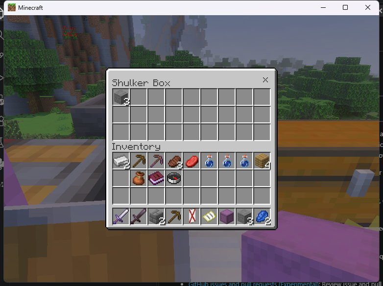
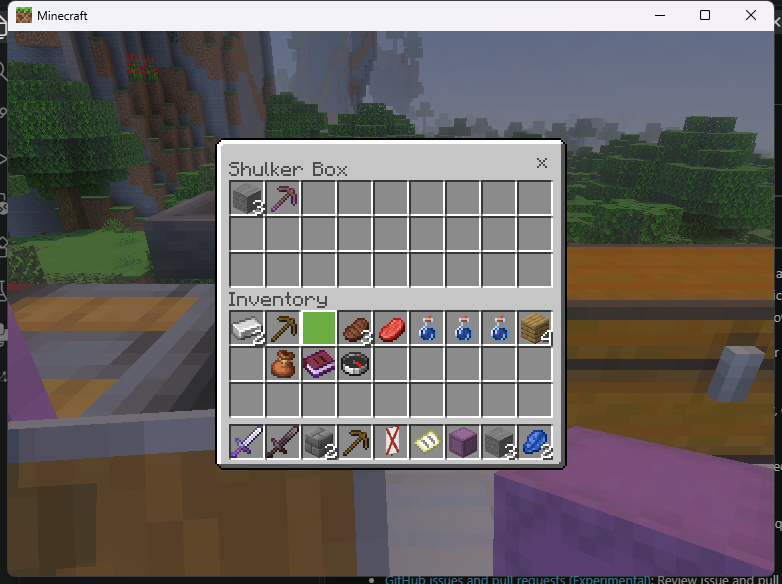

# Experimental held shulker editor

The Linux adapter opens the selected actual shulker through `VCF_REAL_SOURCE`. It uses a real 27-slot stock-client screen, complete BDS saved items, a durable `remote_workstations:held_id` UUID and the guarded inventory writer. This is an original-mode transfer service; it does not implement custom recipes.

## Try it

Enable `experimental_inventory_writes` and `experimental_held_storage`. Join the admitted runtime using Windows Bedrock 1.26.45. Select an existing shulker in hotbar slot 0–8, then use `/vcf_native shulker`.

Permissions: `remoteworkstations.use`, `remoteworkstations.open.shulker`, `remoteworkstations.inventory.write` and the consumer's source permission. The example adds `vcf.examples.passthrough`. Bind sneak-and-use with `/vcf_native bind shulker`. No block is placed in the real world.

## Ownership and transactions

The backing slot is locked. The adapter guards all 36 main-inventory saved items, selected slot, dimension, permissions, native mutation epochs and consumer lifetime. Detached native descriptors preserve unknown item metadata; nested shulkers are refused.

Cursor gestures are staged. A complete transfer publishes a checked full-inventory replacement including the same backing item's contents through six journal boundaries, then emits COMMIT. Source interference invalidates the lease.

An SDK-forced close cancels an unfinished cursor reservation. Escape can cause the vanilla client to complete a cursor-return transfer before sending its close packet; that completed transfer is retained. These are distinct sequences.

## Recorded stock-client checks

- Inserted six existing stones and extracted three; total remained six.
- Reopened with saved contents and durable backing identity intact.
- Forced closure with a partial cursor stack made no inventory write; reopening restored the pre-gesture state.
- Quick-transferred a named enchanted pickaxe into and out of the box. All 36 saved slots then matched the prior image byte for byte.
- Clean restart recovered inventory matching the final journal image.

The [release report](RELEASE_NATIVE_0_5_0.md) identifies packaged artifacts and limits. The screenshots above were captured with the exact release artifact. The [machine-readable record](../research/native-release-0.5.0-native.1.json) binds command opening, quick-transfer round trip, forced cancellation and reopening to its installed hash. Clean-restart and initial stone checks also retain their earlier candidate evidence.

## Limits and recovery

Windows writes/held editing, bundle editing, general nesting rules, full inventories, all lifecycle races, foreign-plugin coexistence and automatic cross-save reconciliation are not qualified. Device/controller/multiplayer checks are untested. Active views time out after five minutes.

After restart, edits are quarantined for explicit `/vcf recovery` review. Use the displayed acceptance token only after checking actual inventory. The journal never automatically issues items. [Six BDS crash tests](NATIVE_INVENTORY_CRASH_TESTS.md) establish detection and retained evidence, not automatic held-editor crash recovery.

The older read-only `inspect_held` API conservatively returns `native_open_available == 0`. Use session capabilities and a session request for this separately enabled experimental adapter. Full bundle reads use `read_inventory_item`; the older inspection API refuses incomplete bundle snapshots.

**Known prerelease issue:** the held-shulker sneak-and-use binding currently refuses an equipment synchronization packet during preparation. Use the tested `/vcf_native shulker` command. No inventory transfer is performed by the refused opening.
