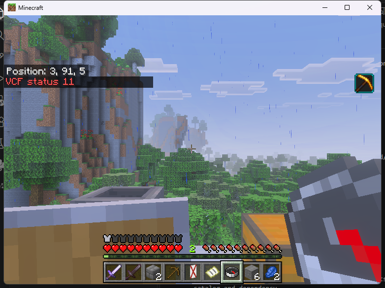

# Linux inventory crash tests

These checks exercise the experimental SDK 1.5 inventory writer in the real
Endstone 0.11.10 / BDS 1.26.45.1 process. They qualify selected crash detection
and explicit review behavior. They do not establish automatic recovery or a
durable commit shared by BDS and another plugin.

The provider SHA-256 is
`b585c2c72539aec3b2e5ecc97ff3df0cbfb2a51ad590d13aaed34f8b994026b9`.
Every run checks the installed provider, both independent compiled consumers
and their actual Endstone shadow copies against the exported public artifacts.
The [runtime guide](NATIVE_LINUX_RUNTIME.md) identifies the pinned server and
loader. The client is Windows Bedrock 1.26.45, using keyboard and mouse.

## Procedure

Each boundary uses its own disposable Docker volume copied from the same
cleanly stopped, fully reviewed fixture. The original fixture stays stopped.
The test connects a stock client and invokes the public SDK example to swap
six stones from slot 7 into empty slot 18. All other main-inventory slots,
including an empty bundle, named shulker and signed test book, are part of the
complete expected image.

A private test-only interposer calls the real `fsync` first, then exits the
process with code 86 only when the exact target transaction and journal boundary
have become durable. It does not modify the shipped provider. Its input is
restricted to the marked fixture and exact inventory journal. The injector,
server files, worlds, raw journals and unredacted captures are not distributed.

After each exit, the harness checks journal framing, CRC, stage order and both
complete 36-slot images. The same fixture restarts without injection. The
operator reviews its actual inventory, attempts a second SDK swap while
quarantined, then explicitly accepts the inspected inventory. Acceptance records
the current contents without granting, removing or restoring any item.

## Recorded results

| Durable boundary | Restarted inventory | Retry while quarantined | Review |
| --- | --- | --- | --- |
| 1: prepared, before setters | Complete before-image | Status 11; journal unchanged | Accepted without item changes |
| 2: debit, after first setter | Complete before-image | Status 11; journal unchanged | Accepted without item changes |
| 3: escrow, after both setters | Complete before-image | Status 11; journal unchanged | Accepted without item changes |
| 4: output, before publication | Complete before-image | Status 11; journal unchanged | Accepted without item changes |
| 5: delivery, after publication | Complete before-image | Status 11; journal unchanged | Accepted without item changes |
| 6: acknowledgement | Complete before-image | Status 11; journal unchanged | Accepted without item changes |

[The compact evidence record](../research/native-linux-inventory-crashes-sdk15.json)
contains the exact artifact, crash-journal and reviewed-journal digests for
all six cases. The private parser checked both complete images and CRCs, and
the stock client displayed status 11 for each refused retry.

The sixth fixture was restarted a second time after explicit acceptance.
At 03:54 UTC on September 10, BDS loaded the acknowledgement, reported no
inventory edits requiring review, and retained the exact reviewed-journal
digest. This checks persistence of the administrator's decision; it does not
turn the earlier inventory edit into an automatically replayable transaction.

That restarted public build also rendered the real 54-slot double chest and
completed its SDK close, then rendered the independent SDK form and dispatched
one action callback. Both consumers returned to zero outstanding tickets, the
provider reported zero sessions and no pending recovery, and the server stopped
cleanly after an explicit client disconnect. No items were transferred in these
two regression checks.

The delivery result demonstrates why a completed plugin journal stage is not
proof that BDS has persisted the new player inventory. Replaying an external
reward from that stage would require an additional ownership and durability
contract. This implementation keeps surviving edits quarantined for review.

## Observations and limits

The first stage-4 command was refused by the client with a cheats-disabled
message before it reached the plugin. There were zero SDK observations and no
new journal record. A later attempt, without configuration changes, reached the
SDK and produced the intended stage-4 exit. The initial refusal is not counted
as a crash-test pass.

After later clean server stops, Minecraft twice remained on a blank screen.
The client closed normally and was relaunched to continue testing. The cause
has not been isolated from client or loader behavior; clean-disconnect rendering
is not qualified by these tests. Explicitly disconnecting the client before
the sixth recovery server's clean stop returned it to the menu normally and
allowed the second-restart check without another client relaunch.

These are process-exit checks, not host power-loss or filesystem-failure tests.
Full/recursive held storage, editor submission, automatic reconciliation,
Windows native writes, hostile plugins and multiplayer interleavings need
separate implementation and evidence. The complete catalog release gate
remains in force.
