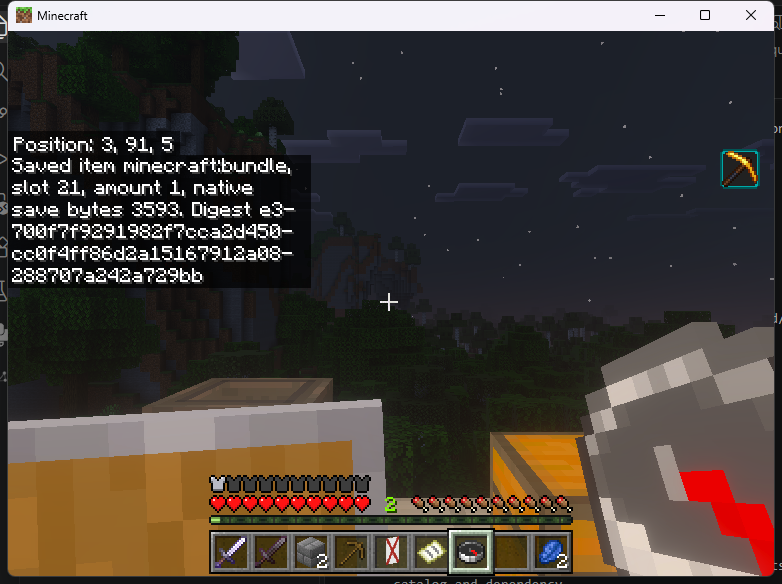
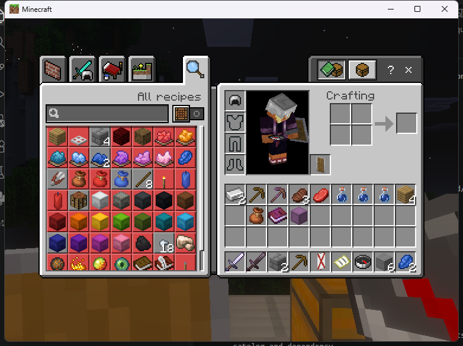

# Native inventory edits and recovery

The developing C++ backend exposes a guarded inventory write operation in SDK
1.5. It operates on complete native saved items and a prior SDK 1.4 observation.
This is a low-level building block for held editors and custom transactions.
It does not yet qualify a shulker, bundle or workstation editor.

The implementation is currently Linux-only, pinned to Endstone 0.11.10 and
BDS 1.26.45.1. Windows builds expose the same SDK table and return unavailable
when no admitted writer exists. Build tests are separate from client and crash
qualification; see the native acceptance record for actual runtime evidence.

## Selected stock-client checks

The Linux provider with SHA-256
`b585c2c72539aec3b2e5ecc97ff3df0cbfb2a51ad590d13aaed34f8b994026b9`
loaded with both compiled consumers on the pinned Endstone/BDS fixture. The
installed files and Endstone's actually mapped copies matched the exported
public artifacts. A Windows Bedrock client completed these checks:

- Moved six stones between an occupied and an empty main-inventory slot.
- Swapped a bundle containing those six stones with a named empty shulker,
  then returned both items. All other main-inventory slots stayed unchanged.
- Read the complete filled bundle after transfer: 3,593 native bytes, weight
  10, with the original full digest. The named shulker's 202 bytes also survived.
- Extracted all six stones from the returned bundle using vanilla inventory
  controls, then restored the original slots with no cursor item.

The three corrected transactions reached all six durable journal stages. Each
setter also passed all five native save-view checks during the active batch.
The next transaction's full before-image matched the preceding after-image,
checking survival after the previous native temporary objects were destroyed.
[The compact evidence record](../research/native-linux-inventory-writer-sdk15.json)
contains the item and journal digests.





An earlier candidate's save-view preparation stripped serialized component
metadata from an empty bundle and was rejected. The corrected candidate uses
detached item projections for every context. These selected checks establish
main-inventory batch behavior; they do not qualify a held-container editor,
nested/full-bundle policies or Windows writes. Separate
[six-boundary BDS crash tests](NATIVE_INVENTORY_CRASH_TESTS.md) passed crash
detection, complete before-image retention, refusal of retries while quarantined
and explicit review. Automatic reconciliation remains incomplete.

## Enable in an isolated test server

Add `"experimental_inventory_writes": true` to the provider's `config.json`.
It defaults to false. The provider uses its own `inventory-edits.vcf` journal
in its data folder. Do not remove that journal to bypass recovery.

The connected player needs `remoteworkstations.use`,
`remoteworkstations.inventory.read` and
`remoteworkstations.inventory.write`. These inventory permissions default to
operators. The caller must be an enabled registered consumer.

## Make an edit

1. Observe a nonempty inventory slot with `observe_inventory_item`.
2. Read each participating slot using `read_inventory_item`.
3. Supply unique `vcf_inventory_edit` descriptors with each slot's expected and
   replacement **complete saved compound**.
4. Call `apply_inventory_edit` with the observation. Once the attempt enters
   backend admission, it consumes the observation on success or failure.

A zero-length saved item means an empty slot. It is different from a nonempty
item with an empty user metadata compound. These bytes are not `getNbt()` user
data, SNBT or network item data. Reconstruction must reproduce the complete
requested bytes before a setter can run, including native storage components
and typed empty lists. BDS-normalized or lossy reconstructions are refused.

Each operation accepts 1–36 unique main-inventory slots, up to 64 KiB per saved
item and 256 KiB of combined expected/replacement input. The native writer also
bounds its complete inventory and save snapshots. Armor, offhand, cursor, Ender
Chest and another container are outside this operation.

The compiled `NativePassthrough` example demonstrates the public API without
private header access:

```text
/vcf_native swap-items "19,21"
```

The first slot must contain an item; the second can be empty. It reads both
slots, preserves the complete saved stacks and attempts a journaled swap.
Use this only with the separately enabled experimental writer.

## What a commit protects

The native backend reconstructs all changed before/after items before writing.
It validates the observation, player lifetime, permissions and full inventory
again, then builds native `ListTag` snapshots for all five admitted save
contexts. The native inventory serializer retains its slot layout while an
item-save hook supplies a fresh detached item for each context. Non-Disk
serialization must not operate on the player's live item: testing found that
save-view preparation could strip a bundle's serialized component metadata.
The Disk projection must exactly match a native Disk save, and the complete
live inventory is revalidated before publication. Reentrant inventory saves
receive copies of the appropriate
baseline until publication or rollback completes. A setter permit rejects
unexpected nested setters, and nonempty native item-request processing aborts
the operation. Normal observations cannot read a partially applied batch.

Every setter is followed by calls through the installed native save entry for
all five contexts, checking that each still returns its complete baseline, and
by a complete inventory readback. If the operation
fails, rollback is permitted only while every slot still matches one of that
exact operation's before/after values. An unrelated value is retained and the
operation becomes uncertain. Replacements are never guessed from metadata.

`VCF_OK` means the native edit completed and its journal acknowledgements were
written. `VCF_QUARANTINED` means **do not retry**: the operation may already have
committed, or rollback could not be established. Close the affected UI and ask
an administrator to review it. Other failures consume the admitted observation;
take a fresh observation before considering a new operation.

## Recovery after restart

BDS player saves and this plugin's journal are separate durability domains.
The current recovery policy requires administrator review for every surviving
edit after restart, even when the saved inventory matches the expected result.
An exact match alone is not an acknowledgement or proof against an A–B–A change.
The framework blocks further framework inventory edits for that player until
review; it does not automatically mint replacements or replay delivery.

An operator with `remoteworkstations.inventory.recovery` can inspect an online
player with:

```text
/vcf recovery PlayerName
```

The report identifies the durable journal stage and whether the inventory
matches before, after, a mixture, or unrelated changes. It supplies a temporary
review token. After reviewing the actual inventory, use the displayed command:

```text
/vcf accept-current "transaction,review-token"
```

This explicitly acknowledges the current inventory without granting, removing
or restoring anything. Tokens belong to the command sender, expire after 60
seconds, and fail if the inventory or its mutation epochs changed. The
acknowledgement is durable and survives another restart. This is an inventory
decision, not an automatic reconciliation of any external plugin's storage.

The journal is bounded to 64 MiB and refuses further appends at capacity. Keep
it with the corresponding world backup. Journal rotation, automatic cross-domain
reconciliation and the full held-editor catalog remain separate release work.
