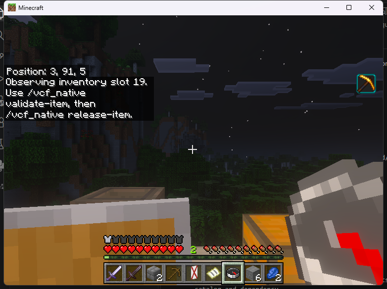
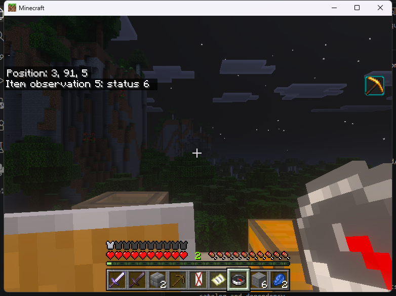
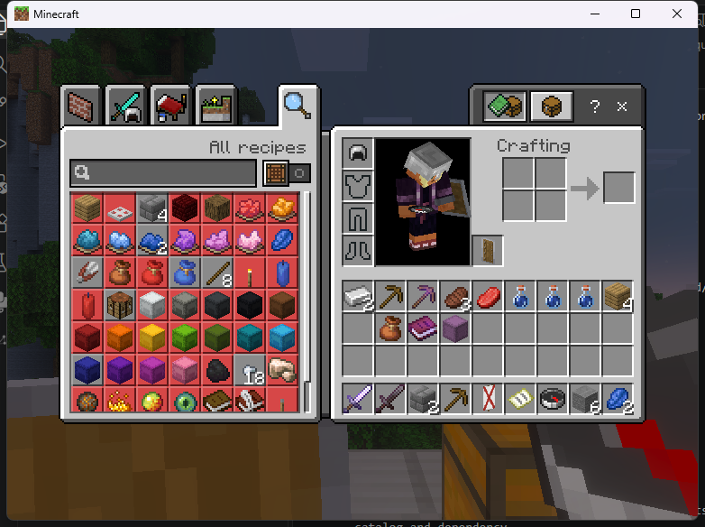

# Inventory observations (SDK 1.4)

An observation lets a consumer detect changes to a saved item across calls.
The provider retains the source's lifetime, native mutation revisions
and complete saved bytes. A vanilla move away and back invalidates it even when
the bytes are identical. Native bundle requests also invalidate it when BDS
changes a component without an ordinary slot notification.

This is an optimistic check. Vanilla inventory operations continue. The handle
does not lock an item, authorize a write, track a selected hotbar slot, or provide
durable held-container editing. Those editor and persistence requirements remain
in the [held-item work](NATIVE_HELD_ITEMS.md).

## Use from a consumer

Compile against `find_package(OnistoneVCF 1.5 CONFIG REQUIRED)` and declare an
Endstone dependency on `onistone_vcf`. The player must have both
`remoteworkstations.use` and `remoteworkstations.inventory.read`; these are checked
again on validation. Calls run on the server thread outside framework callbacks.

```cpp
vcf_handle observation = ui.observe_inventory_item(player_uuid, 19);
try {
    auto saved = ui.read_inventory_item(player_uuid, 19);
    ui.validate_inventory_observation(observation);
    // Use the saved bytes for planning. Validate again before using a delayed
    // result. An observation never grants authority to write this inventory.
    ui.release_inventory_observation(observation);
} catch (...) {
    ui.api().release_inventory_observation(ui.owner(), observation);
    throw;
}
```

Slots are main inventory indices 0 through 35. Empty slots refuse with
`VCF_NOT_FOUND`. The provider allows 64 observations per consumer and 256 total.
Handles are owned by their consumer; another consumer cannot validate or release
one. Permission or native validation failure remains latched until release.
Wrong-thread and foreign-owner calls do not modify the observation.

| Result | Meaning |
| --- | --- |
| `VCF_OK` | Revisions, source lifetime, permissions and saved bytes still match. |
| `VCF_STALE` | A watched mutation or saved-byte change invalidated the observation. |
| `VCF_REENTRANT` | A native mutation/request or framework callback is in progress. |
| `VCF_DENIED` | Ownership or permission check failed. |
| `VCF_CLOSED` / `VCF_NOT_FOUND` | Source/consumer retired, or the handle was removed. |
| `VCF_QUARANTINED` | An unexpected mutation thread or broken revision invariant was observed. |
| `VCF_UNAVAILABLE` | The platform or exact native hook admission is unavailable. |

Quit, death, teleport, dimension change and provider shutdown retire the native
watch. Consumer revocation releases all its observations. Release handles when
finished; invalid observations still count toward the resource limit.

## Platform and transaction boundary

Linux uses the pinned Endstone 0.11.10 / BDS 1.26.45.1 ABI. The provider installs
three forwarding hooks at startup: inventory setters, container change
notifications and nonempty native item-request processing. It admits full
function hashes before patching and checks the installed patch bytes before
capture and validation. Empty request polls do not stale an observation.
Mutation scopes cover both entry and exit, including nested calls and exceptions.
The whole inventory revision invalidates conservatively even if another slot
changed. Complete native saved bytes provide an additional comparison.
Any nonempty native request batch invalidates conservatively, including one that
ultimately makes no change. A direct component mutator outside the verified
hooks still needs separate qualification; byte comparisons alone cannot detect
an unobserved change that restores the original bytes. This is why an observation
is not advertised as exclusive item identity or a held-item lock.

Provider code and trampolines remain pinned until server exit. Installation
requires startup with no online players; disable retires watches instead of
removing hooks while callbacks could be executing. A detected off-thread native
inventory mutation disables observation admission until restart.

Windows exposes the same SDK table and returns `VCF_UNAVAILABLE` for observations.
Linux calling conventions and offsets are not applied to Windows.

The native storage `Reservation` now requires a guard. It checks that guard before
and after its baseline read and immediately before publication. A native adapter
must bind lifetime, permission and mutation admission there and renew its baseline
only after a verified write. The storage planner still does not provide a live
BDS writer, save barrier or crash reconciliation by itself.

ABI 1.0 through 1.3 consumers keep their original table prefixes. The current C++
headers and installed CMake package require SDK 1.5. The observation operations
were introduced in ABI 1.4; existing 1.4 C consumers retain that table prefix.

## Compiled example

The `NativePassthrough` consumer provides these player commands:

```text
/vcf_native observe-item "19"
/vcf_native validate-item
/vcf_native release-item
```

Quote the numeric slot because the Bedrock command parameter is a string.
The console can run `vcf_native validate-items` to check that consumer's existing
observations, and `vcf_native status` reports its creation/validation counts.
These commands do not move items or write their metadata.

## Tested Linux checkpoint

The [b926022 runtime record](../research/native-evidence/linux-b926022-inventory-observations.json)
identifies the exact installed and mapped provider/consumer hashes. The compiled
SDK created six observations: idle validation, move-away-and-return refusal,
native bundle extraction refusal, fresh admission, explicit release, teleport
retirement and quit cleanup were exercised. The original double chest and form
callback also passed. All six stones and the empty bundle returned to their
original slots, with no cursor item.



The old observation returned `VCF_STALE` (6) after the bundle was moved away and
back, although its complete saved bytes matched the original snapshot.





Local checks passed: 18 Linux tests, 17 tests in each Windows configuration and
18 ASan/UBSan tests. CI passed the Linux build/sanitizers, both Windows builds
and the legacy suite. The full-scope release gate still refuses this development
checkpoint. These tests do not qualify a held-item writer or crash recovery.
