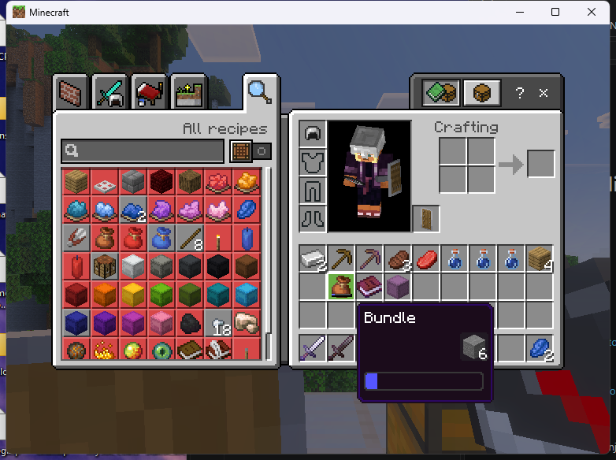
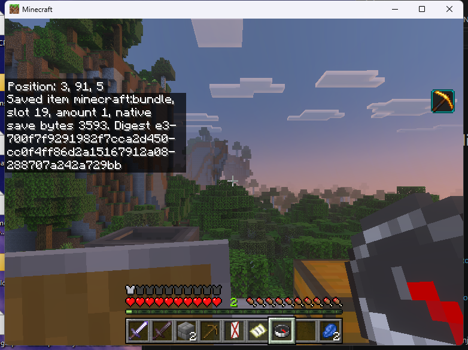
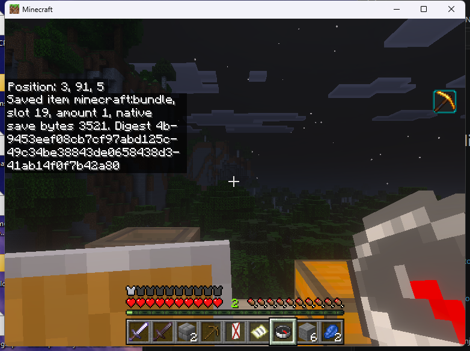
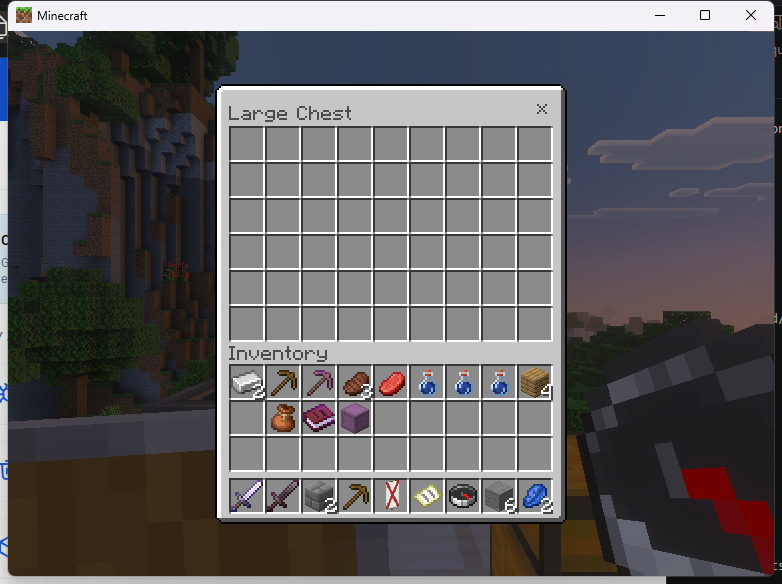

# Native saved-item reads

SDK 1.3 adds `read_inventory_item(player_uuid, slot)`. It reads a connected
player's main inventory slots 0–35, including the hotbar at 0–8. It returns
detached native saved-item NBT, a description and a SHA-256 digest. It does not
open a UI, reserve an item, assign an identity or write to the inventory.

The Linux adapter admits only the supplied Endstone 0.11.10 / BDS 1.26.45.1
binary pair. Windows currently returns `VCF_UNAVAILABLE` for this operation;
its native save adapter requires independent implementation and verification.
This operation does not qualify custom UIs, held editors or crash recovery.

```cpp
// Keep ui as a plugin member; dispose it before unloading your plugin.
oni::vcf::sdk::Client ui(oni::vcf::sdk::discover(), "my_plugin");
auto saved = ui.read_inventory_item(player.getUniqueId().str(), 19);
// saved.info: identifier, amount, auxiliary value, slot, format, byte count,
//             and a 32-byte digest.
// saved.nbt: an owned std::vector<uint8_t> containing native saved-item NBT.
```

The target player needs `remoteworkstations.use` and the new
`remoteworkstations.inventory.read` permission, which defaults to operators.
The consumer must be enabled and registered. Calls run on the server owner
thread, and permissions and consumer lifetime are checked again before the
result is returned. Consumers must apply their own policy before reading
another player's inventory. Saved NBT can include private book text and other
item data; the example prints only counts, types and digests.

Try `/vcf_native read-item "19"` with the matching compiled example consumer.
Keep the quotes: this generic example command declares its second argument as
a string, so Bedrock rejects an unquoted number before invoking the plugin.
`/vcf_native status` reports saved-item read successes and refusals separately
from held inspection and UI tickets. Invalid slots refuse; an empty slot returns
`VCF_NOT_FOUND`. Unsupported native layouts or changed function fingerprints
return `VCF_UNAVAILABLE`. A changed item during the read returns `VCF_STALE`.

## Saved format and metadata preservation

`VCF_BDS_ITEM_SAVE_NBT` is standard little-endian named-compound NBT with an
empty root name, produced from BDS's `ItemStackBase` save with
`SaveUseCase::SaveToDisk`. It includes the native `Name`, `Count`, `Damage`,
other saved fields and the `tag` compound when present. It is different from
`ItemStack::getNbt()` user data and from the metadata argument to `vcf_item`.
**Do not pass this whole saved compound to `set_item` as user metadata.**

The serializer asks the native detached tag to write through a bounded output
interface. It preserves native tag widths, empty-list element types, compound
ordering and numeric bits. It does not pass through Endstone's public NBT
converter, whose empty-list conversion loses the declared element type.
Malformed NBT and non-finite numbers refuse. Bounds are 64 KiB per item,
16,384 output calls and the core NBT validator's depth/node limits. Exceeding
these limits refuses the read rather than truncating the item.

The Linux implementation compares native save bytes from the live slot, an
independent public SDK item copy serialized through the native save routine,
and the live slot again. It verifies the inventory owner, exact native class,
slot getters, object layout, save functions, native tag writer and destructor.
The native save object is released by its native deleting destructor; native
allocations never transfer to the consumer.

The digest is SHA-256 of exactly `saved.nbt`. Slot and player identity are not
included. It is a content observation, not proof that an identical physical
item was not replaced between reads. Saved references such as map IDs still
refer to external world data. A save snapshot does not include an entire world,
establish a safe reconstruction policy, or grant writeback authority. The format
is tied to the admitted BDS build and is not promised portable across versions.

## Bundle investigation

The private Linux diagnostic compared every occupied inventory slot before,
during and after moving the existing six test stones into an existing bundle
through the vanilla client. The native bundle save changed from 3,521 to 3,593
bytes and contained six stones at
`tag/storage_item_component_content/0`. All other item saves stayed identical.
After extraction, every slot and the complete inventory save matched the
initial snapshot. Public SDK copies produced identical native save bytes for
the tested items. The private diagnostic installed no hooks and performed no
inventory writes; vanilla client gestures performed the transfers.

That diagnostic is ABI evidence, not public-artifact qualification or evidence
of safe bundle reconstruction, dynamic-container reassignment or held editing.
The older SDK 1.2 `inspect_held` contract remains unchanged and still refuses
bundles because its public user-metadata observation omits their contents.

## Public Linux client evidence

The [SDK 1.3 runtime record](../research/native-evidence/linux-a3fbf78-saved-item-smoke.json)
uses the same three public plugin binaries as CI, with no diagnostic plugin
installed. Nine reads passed: empty/filled/restored bundle states, a named
enchanted pickaxe, an awkward potion, a signed book and a named empty shulker.
The two empty-slot reads refused as expected. Moving the filled bundle from
main inventory to the selected hotbar slot preserved its save bytes and digest.





After vanilla extraction returned all six stones, the empty bundle again
produced its original 3,521-byte save and digest. The server stopped cleanly
with no open sessions, tickets or packet-observer refusals.



The [follow-up regression](../research/native-evidence/linux-a3fbf78-resumed-regression.json)
on the same public artifact completed the previously blocked checks: reading
six stones returned 120 saved bytes; the original 54-slot double chest opened
and closed through the SDK; and a rendered form delivered one button callback.
All tickets were released, with no failures or packet-observer refusals.
The server stopped cleanly with unchanged item counts.



This checkpoint does not qualify native editors,
writeback, reconstruction, recovery or the Windows saved-item adapter.
See the [build and CI checkpoint](../research/native-evidence/checkpoint-a3fbf78.json)
for the 16-test sanitizer run, 300,000 fuzz inputs and exact artifact hashes.

## Detached reconstruction investigation

A later [isolated Linux diagnostic](../research/linux-item-reconstruction-abi.json)
parsed 62 saved fixture snapshots through Endstone's native-tag parser, then
constructed native BDS items from those tags. Across two passes, all 124
constructions reproduced the input bytes. Public SDK copies still reproduced
those bytes after each native temporary was destroyed. Two typed empty-list
cases also roundtripped exactly. The set includes empty and filled bundles.

This diagnostic ran with no players connected, after backing up the disposable
world. It accessed no player inventory and installed no write hooks. Its private
plugin was removed after the results were preserved. These results establish
the tested detached parsing, construction and cleanup path; live reassignment,
mutation isolation, identity locks and save/crash recovery still need work.
Reconstruction is not yet exposed as a public SDK operation.

A separate [copy-isolation diagnostic](../research/linux-item-copy-isolation.json)
then added two saved items with typed empty lists. Across two passes over 64
fixtures, every native reconstruction and independent copy stayed byte-identical
when a sibling copy's metadata/count was changed and that sibling was destroyed.
The public metadata roundtrip preserved unrelated saved bytes for the 62
retained fixtures, but lost the declared empty-list types in both added controls.
The direct native path preserved all 64. A future generic writer must preserve
the native saved representation rather than rely on `getNbt()`/`setNbt()`.

The [Linux inventory hook diagnostic](../research/linux-inventory-hooks.json)
then exercised native save, container-change and force-balance setter hooks.
Identical stone replacement kept the saved inventory bytes unchanged and
advanced the setter counter, although BDS skipped its change notification.
Vanilla quick-move advanced counters for both affected slots; restoration
returned the complete inventory to its original digest. Disconnect cleared
the watch and subsequent native saves continued through the original path.

The bundle control exposed a remaining gap: vanilla extraction changed saved
contents without advancing that bundle slot's counter. These three hooks
alone cannot authorize an exclusive held-item edit. The source and exact
fingerprints are retained with the diagnostic, while native mutation-path
coverage, save barriers and crash recovery remain incomplete.

## C caller storage

Use `read_inventory_item(owner, player, slot, &info, buffer, capacity,
&required_bytes)`. Initialize `info.size` and `info.version`. A 65,536-byte
buffer avoids a second observation. A null buffer with capacity zero is a size
query and returns `VCF_BUFFER`; only `required_bytes` changes. An insufficient
buffer behaves the same way. All other failures leave all outputs unchanged.
Successful calls fill the description, exactly the returned number of bytes,
and `required_bytes`. A query does not freeze the slot for the next call.

ABI 1.0, 1.1 and 1.2 binaries retain their negotiated prefixes and descriptor
versions. The new C++ SDK and this operation require ABI 1.3.
