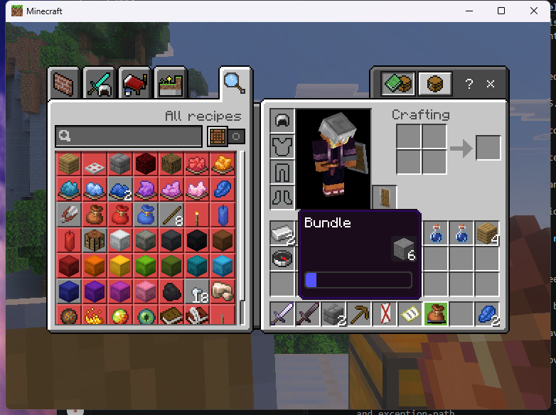
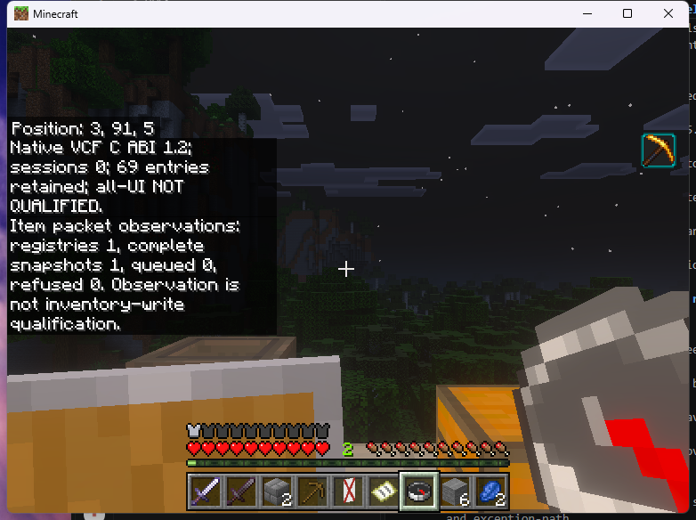

> **v0.5.0-native.1:** see the new [actual held shulker editor](NATIVE_HELD_STORAGE.md), [installation](NATIVE_INSTALLATION.md) and [prerelease qualification](RELEASE_NATIVE_0_5_0.md). Historical checks below retain their original artifact scope.

# Native storage transaction core

`framework/storage.cpp` ports the bounded protocol-2169 request contract and
cursor reservation model retained in the immutable source baseline. It is a
native core implementation; no active server packet handler or valuable-item
writer uses it yet. Storage, Ender Chest, shulker and bundle gameplay therefore
remain unqualified.

`framework/packet_items.cpp` now supplies the separate native descriptor,
content (49), slot (50) and registry (162) codecs. The plugin connects these to
a passive outgoing-packet observer, with deferred decoding from the server
scheduler. `/vcf diagnose` reports complete registry/inventory observations,
pending packets and refusals. The observer sends no packets, invokes no consumer
callbacks, and writes no inventory. Its data is not a native ItemStack or an
authorization grant; packets sent by another plugin cannot authorize transfers.

Descriptor user data remains byte-exact, including opaque NBT, predicate-like
data and item-specific tails. Auxiliary values, block runtime IDs, signed item
IDs, optional stack IDs and dynamic-container references are retained. Registry
component data remains network NBT, with bounded depth, node/array counts,
canonical integers, valid UTF-8, distinct compound keys and unique identifiers
and numeric IDs. This does not synthesize legal shield, nested-container or
adventure-predicate items from partial metadata. Actual native item construction
and metadata-safe publication still need their own implementation and evidence.

The observer requires a complete 36-slot server inventory packet; deltas cannot
invent missing slots. A changed registry invalidates that baseline. Packet
errors, limits and disconnect discard the affected player's cache. Queued data
does not report a ready snapshot. Bounds are 16 players, 32 queued packets per
player, 16 MiB of queued payload, 16 MiB of retained wire data and 65,536 registry
entries across players. Inventory payloads are at most 64 KiB; a registry is at
most 8 MiB. One queued packet is decoded per scheduler tick with fair rotation;
the maximum-size registry's real server latency remains unmeasured.

Ordinary content packets are capped at 54 slots. Registry window 125 permits
up to 64; above 54 it must carry dynamic-container role 63 and an explicit
dynamic ID. A [private login diagnostic](../research/native-evidence/linux-login-dynamic-container-diagnostic.json)
found this 64-slot packet after a valid player inventory while the tester held
an empty bundle. The earlier universal 54-slot limit rejected it and discarded
the player's cache. The corrected decoder retains the separate packet shape,
while the passive observer continues to use only window 0 for its 36-slot
baseline. It neither merges dynamic contents nor grants bundle write authority.
The [public-only `170c27b` test](../research/native-evidence/linux-170c27b-dynamic-smoke.json)
verified one registry/one complete player snapshot/zero refusals at login and
through native bundle insertion/extraction. All six existing stones returned;
empty and filled bundle inspection still refused. Double-chest SDK-close and
the public form callback passed with zero outstanding tickets. All three Linux
plugins matched CI and their loaded modules; no private probe was present.

This verifies bounded passive decoding and baseline preservation. Authoritative
bundle mapping, registry cleanup, held editors and crash/save recovery remain
separate incomplete work.

`item-wire-conformance-2169.json` contains **generated conformance vectors** from
independent Python protocol/rapidnbt serializers, with exact versions and source
hashes. It is explicitly not a client capture. Tests preserve every descriptor
byte, reject every truncated prefix and trailing byte, check malformed network
NBT and queue accounting, and run 10,000 generated content/slot round trips.
The additional item-wire fuzzer checks decode/re-encode equality for all three
packet shapes. These tests cannot qualify stock-client rendering or BDS saves.

The decoder accepts take/place/swap/drop-shaped storage actions, validates both
action discriminants, canonical integers/booleans, slot-reference fields and
negative odd request IDs, and rejects filter strings, trailing data and partial
packets. Bounds are 64 KiB, 100 requests and 100 actions across a payload. Drop
actions can be decoded for a clean refusal; the transaction planner rejects
them because entity creation has a separate durability boundary.

Response decoding/encoding preserves the captured nested optional fields,
container groups, authoritative stack IDs, names, filtered names and durability
corrections. Malformed UTF-8 and noncanonical optional markers refuse. The
sanitized successful and failed server responses round-trip byte-for-byte;
fuzzing also checks that any accepted response re-encodes identically.

Storage topology comes from the retained catalog capacities. The explicit
storage role maps to a storage slot, player hotbar/main inventory or the active
cursor; dynamic containers and workstation roles refuse. Retaining a mapping
for barrel/dropper/trapped chest does not substitute for their separate client
layout tests. Held-shulker role 30 is distinct; no bundle mapping is invented.

The planner checks the session generation, revision, original stack identities,
source/destination policies, exact metadata and stack capacity. It stages every
action in a request before returning a new state. Split stacks receive new
identities; whole-stack transfers and swaps preserve identity. Preview and
result slots cannot pass through this ordinary transfer path. Custom recipe
execution and repeated result extraction need their own integration.

`storage::Reservation` compares the actual inventory with its committed
baseline before each request. An unfinished cursor gesture changes only its
presented snapshot; cancellation restores that baseline without issuing items.
A completed gesture can call a supplied writer. Replays with identical requests
do not call the writer again; changed, old or out-of-order requests refuse.
The replay cache is bounded to 128 accepted requests.

A writer must report a clean pre-write conflict separately from uncertainty.
The constructor also requires a guard. Bind native source lifetime, permission,
and [mutation observation](NATIVE_ITEM_OBSERVATIONS.md) checks to it. It runs
before and after the baseline read and immediately before a completed gesture
reaches the writer. Equal inventory bytes alone cannot admit a moved-and-returned
source. A guard refusal closes the reservation before any writer call.
After any possible mutation, exceptions, failed verification and allocation
failures keep the reservation quarantined and closed. Cancellation then retains
the reconciliation evidence; it never overwrites native inventory or mints a
replacement. This contract is **not** an atomic BDS/plugin save mechanism.
The durable journal and the verified native save interception still need to
be connected and qualified at actual server crash boundaries.

The C++ capture test reads the exact frozen sanitized Ender Chest fixture
(`be5edbd322c6afbd222072f084cb376c994b37b8b2df1857060adac23cd5c65d`).
It checks all request prefixes, a real request sequence's role/identity shapes,
replay and changed replay, an unfinished cursor gesture, failed post-write
reads and the captured wrong-identity request. Test item metadata is synthetic;
these tests are not a new live ItemStack codec qualification. Another 10,000
generated transfer/swap cases check conservation and identity uniqueness.

The Docker sanitizer target adds 100,000 coverage-guided storage decoder inputs,
seeded from that hashed fixture, beside the NBT fuzz target. Logs identify the
tested source revision. Neither synthetic fuzz data nor historical captures
count as interactive qualification of the new plugin.
