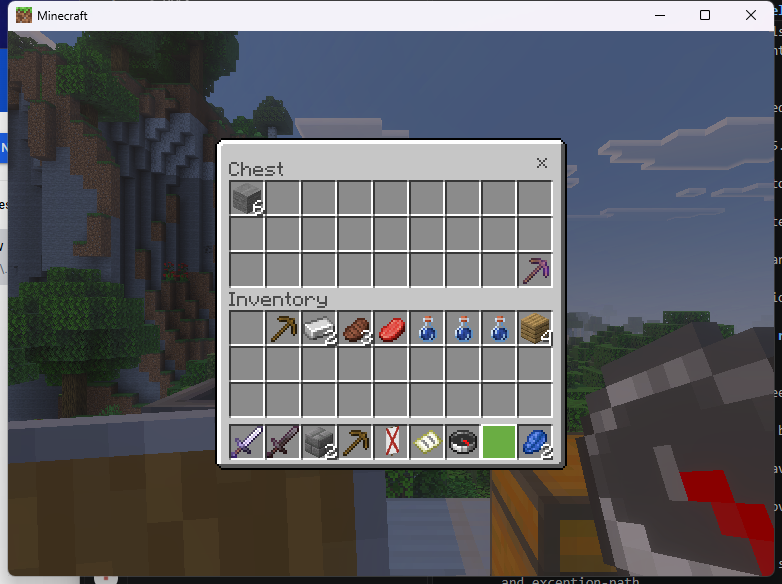
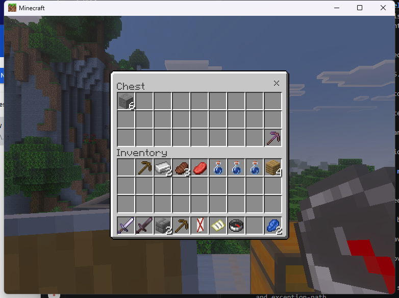
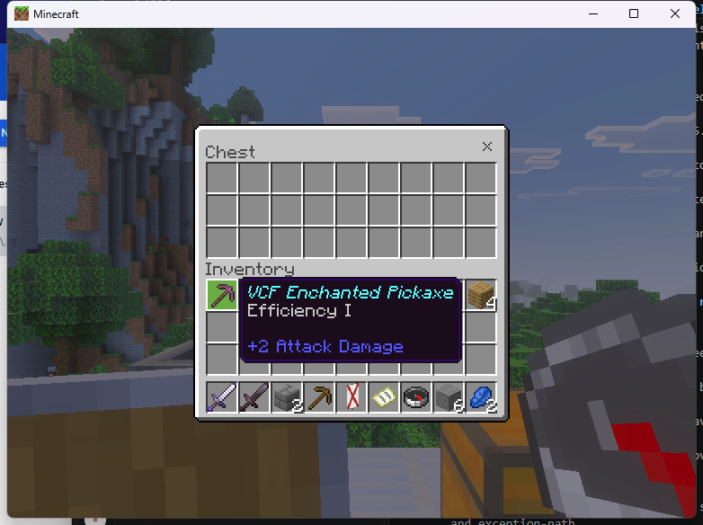
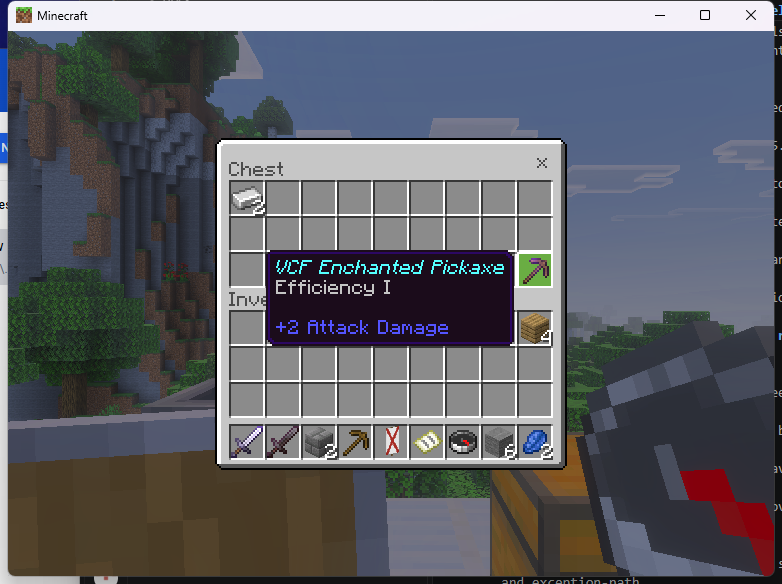
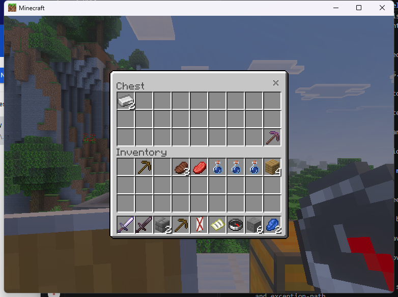
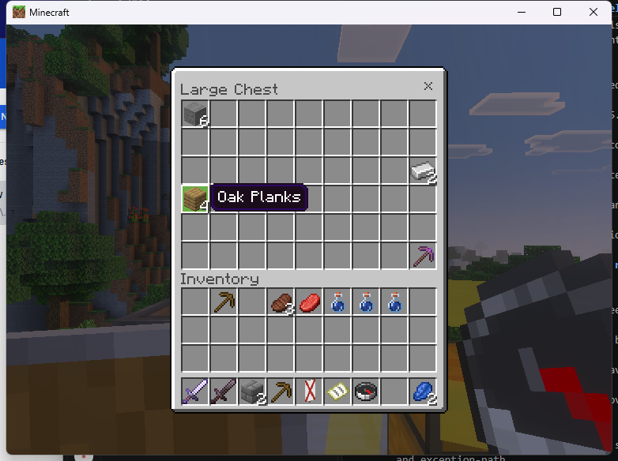
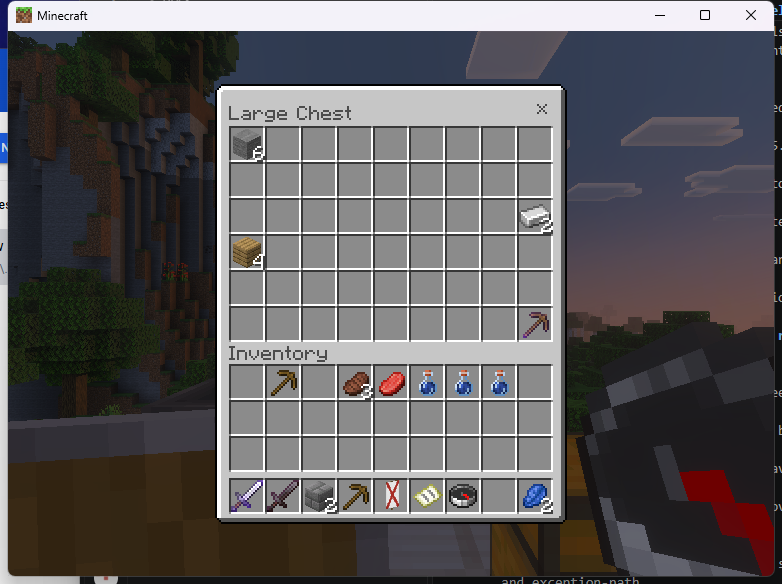
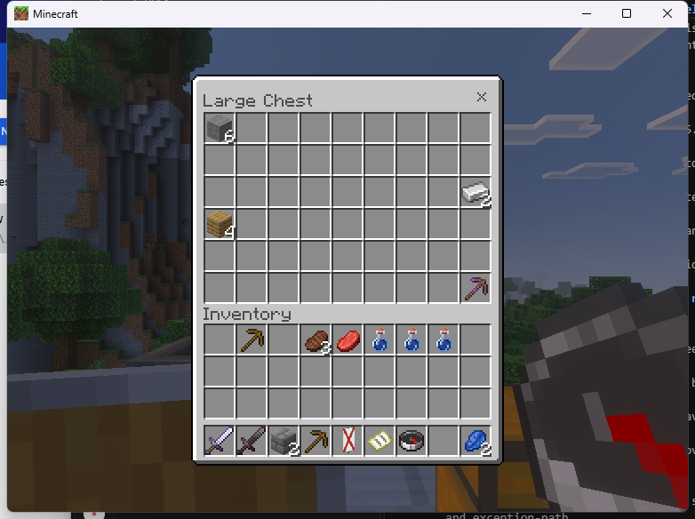
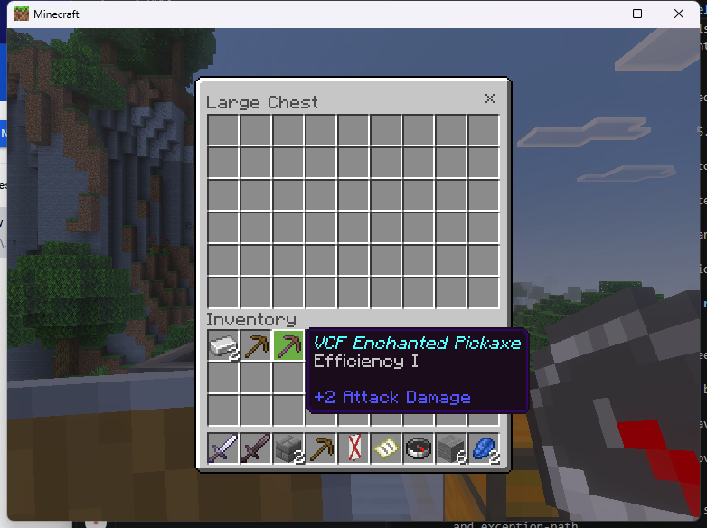
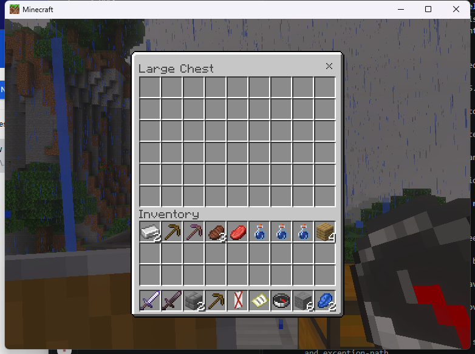

# Linked chest SDK example

The experimental Linux adapter accepts `chest` and `trappedchest` for real,
unpaired 27-slot sources, and `doublechest` for two paired ordinary chests with
54 slots. It targets the exact admitted Endstone 0.11.10 / BDS 1.26.45.1 runtime.
The exact `b0ebf22` stock-PC run passed selected transfers, metadata retention,
SDK/native closure and paired-source protection tests. Custom storage and Windows
admission remain incomplete.

Install the provider and native passthrough consumer using the
[Linux setup](linux-native-workstations.md#install-and-open), and enable
`experimental_original_linux`. Supply an existing authorized source within six
blocks, in an already loaded chunk. For a double chest both halves must meet
these requirements. Keep the literal coordinate quotes:

```text
/vcf_native chest "1,91,3"
/vcf_native trappedchest "1,91,5"
/vcf_native doublechest "1,91,7"
/vcf_native close
```

A developer requests the canonical ID through the installed
[CMake SDK dependency](../NATIVE_SDK.md#use-the-installed-cmake-package):

```cpp
auto request = oni::vcf::sdk::descriptor<vcf_session_desc>();
request.player = oni::vcf::sdk::view(player_uuid);
request.canonical_id = oni::vcf::sdk::view("doublechest");
request.mode = VCF_REAL_SOURCE;
request.dimension = oni::vcf::sdk::view(dimension_name);
request.x = source_x;
request.y = source_y;
request.z = source_z;
request.source_permission = oni::vcf::sdk::view("myplugin.chest");
request.callback = on_session_event;
request.context = this;
vcf_handle ticket = 0;
oni::vcf::sdk::checked(ui.api().prepare(ui.owner(), &request, &ticket));
ui.open(ticket);
```

Register the consumer permission, handle lifecycle callbacks and forget terminal
tickets. BDS owns the actual chest items, slot order, names and enchantments.
The adapter refuses preloaded items, changed slot policies, custom rules, wrong
block families and a paired source requested as a single chest. `doublechest`
currently accepts ordinary chests; a paired trapped chest is not admitted.

The [Linux ABI record](../../research/native-evidence/linux-linked-chest-abi-126451.json)
identifies the shared block factory, the actual chest container subobject and
the native 27/54-slot getter. Both actors must point back to one another and
resolve at the captured adjacent positions. The provider rechecks identities,
permissions, distance and dimension during the session, before incoming stack
requests and before publishing matching native contents or slot updates.

## Protect both halves

A registered SDK guard receives separate callbacks for the two source positions
under the same ticket and canonical ID. Check each callback's dimension and
coordinates against your protection policy. Returning anything except `VCF_OK`
denies continuation. Callbacks can repeat; avoid side effects such as charging a
fee every time a guard runs. The session retains its original requested source.

The compiled example includes an operator-only, in-memory demonstration policy:

```text
/vcf_native guard-deny "Overworld|2,91,7"
/vcf_native doublechest "1,91,7"
/vcf_native guard-clear
```

Use the exact, case-sensitive Endstone dimension name. This fixture reports
`Overworld`; lowercase `overworld` did not match it. These commands also work from the server
console. If the denied position is the paired half, the request must refuse even
though the requested half is allowed. Setting the policy while the chest is open
must close that consumer's session. The demonstration policy affects only this
example's tickets, and resets when its plugin restarts. Production protection
plugins should register their own scoped guards.

## Stock-client evidence

The [exact runtime record](../../research/native-evidence/linux-b0ebf22-chest-smoke.json)
identifies the source revision, loaded provider, both independent consumers and
CI artifacts. Only those three public plugins were installed.

Single-chest tests stored six stone in slot 0 and a named Efficiency I wooden
pickaxe in slot 26. SDK close and reopen preserved both stacks. Shift-click and
ordinary withdrawal recovered their counts and metadata; native X closure passed.





The trapped chest stored two ingots and the same enchanted pickaxe across SDK
closure. Intentional permission loss closed a reopened view. Restoring access
allowed reopening and recovery of both items, followed by native Escape closure.




The double chest held six stone in slot 0, two ingots in 26, four oak planks in
27 and the named enchanted pickaxe in 53. After SDK closure, opening through the
other block preserved every stack's slot and count. Denying only the paired half
closed the active view and refused another opening. Clearing that guard allowed
all four stacks to be recovered with unchanged counts and pickaxe metadata.






Removing the verified-empty partner closed the session. A double request against
the remaining single source refused; after recreating the partner, a single
request against the paired source also refused. A restored double request opened
54 empty slots and native X closure passed. A trapped request against a normal
chest refused before opening.



Empty hopper, beacon and crafter SDK-close regressions and the independent form
callback passed. Twelve openings ended in nine normal closes and three active
failures, plus four pre-open refusals. No tickets, provider sessions or queued
inventory packets remained at clean shutdown. All three Linux CI binaries
matched the loaded artifacts; 14 sanitizer tests and 300,000 fuzz inputs passed.

## Qualification limits

These selected checks do not establish full gameplay or release qualification.
Redstone behavior, obstruction handling, adversarial pairing changes, same-address
actor reuse, shared access, save/crash recovery and all custom modes remain
separate requirements. Paired trapped chests remain outside this adapter.
