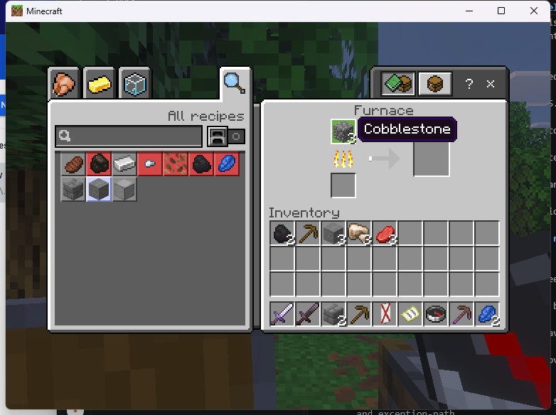
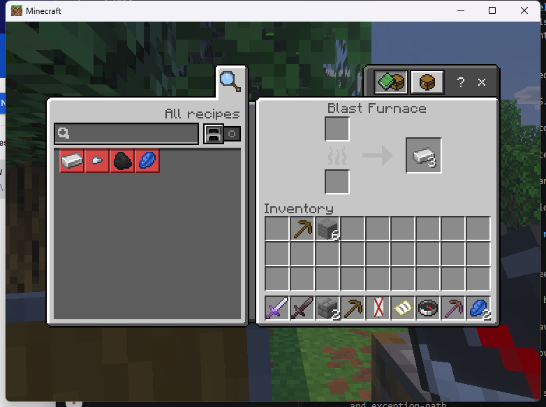
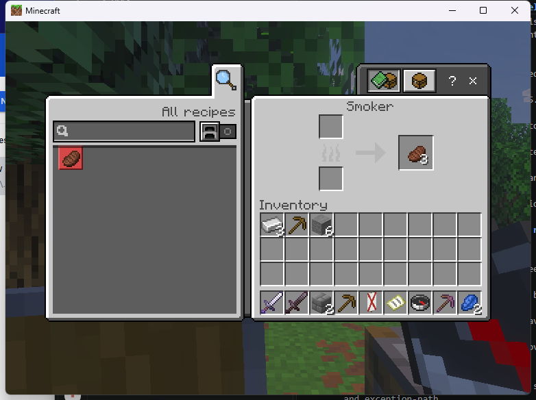
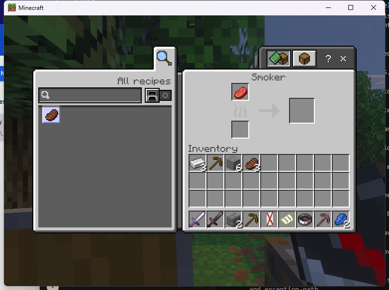

# Linked furnace SDK example on Linux

The experimental Linux adapter accepts `furnace`, `blastfurnace` and `smoker`
with `VCF_REAL_SOURCE`. Each uses its own fingerprinted native factory and
requires an existing matching block actor. Selected stock-PC gameplay and cleanup
checks passed on the exact `7a938e5` build; full qualification remains incomplete.
Custom machine recipes, timers and plugin-owned contents remain incomplete.

Use the exact admitted Endstone 0.11.10 / BDS 1.26.45.1 Linux runtime and the
stock Windows Bedrock 1.26.45 client. Install the provider and the native
passthrough consumer as described in the [workstation example](linux-native-workstations.md).
Enable `experimental_original_linux` in the provider configuration.

The operator-only demonstration accepts a **quoted** coordinate string:

```text
/vcf_native furnace "2,81,5"
/vcf_native blastfurnace "2,81,4"
/vcf_native smoker "2,81,6"
/vcf_native close
```

Replace these coordinates with your existing test blocks. The example creates
no blocks. The source must be within six blocks of the player, in the current
dimension and in an already loaded chunk. Both lit and unlit states of the
matching machine are accepted. Items, fuel, progress and vanilla processing
belong to the actual block; closing the view does not move its contents into
the player's inventory. No remote-distance override is implemented.

## Dependent plugin

After resolving an authorized source in your own server logic, submit its
dimension and position through the existing C ABI 1.1 descriptor:

```cpp
auto request = oni::vcf::sdk::descriptor<vcf_session_desc>();
request.player = oni::vcf::sdk::view(player_uuid);
request.canonical_id = oni::vcf::sdk::view("furnace");
request.mode = VCF_REAL_SOURCE;
request.dimension = oni::vcf::sdk::view(source_dimension);
request.x = source_x;
request.y = source_y;
request.z = source_z;
request.source_permission = oni::vcf::sdk::view("my_plugin.machine");
request.callback = completed;
request.context = this;
vcf_handle ticket = 0;
oni::vcf::sdk::checked(ui.api().prepare(ui.owner(), &request, &ticket));
ui.open(ticket);
```

The descriptor strings are copied by `prepare`. Keep callback code and context
alive until consumer revocation completes, and collect terminal tickets with
`forget`. See [SDK lifecycle and guards](../NATIVE_SDK.md).

The adapter requires an explicit source permission and rejects custom items,
rules, titles and unrelated entity/held descriptors. Source guards run during
dispatch, readiness and active checks, including before incoming item requests.
The adapter checks block family, actor type, position and the captured actor
address again. Source disappearance, range/dimension changes or revoked access
end the session. These checks do not establish protection against every possible
same-address replacement by another native plugin.

The short catalog aliases still need native source-configuration migration;
use the dependent-plugin descriptor or this example's explicit-source command.
This example does not qualify custom processing, crash/save recovery, other
devices or multiplayer. The [Linux ABI record](../../research/native-evidence/linux-linked-furnace-abi-126451.json)
records the separate const source accessor and all three factory identities.

The first `26528a7` PC run exposed an SDK-close failure: it sent container type
None, the furnace stayed open and the five-second timeout quarantined the
session. Rejoining retained all three smelted stones; ordinary-click extraction
and native Escape closure passed. The close packet now carries the actual
active container type. The `7a938e5` run verified SDK closure for all three
machines and regression closure for enchanting and crafting.

## Recorded PC checks

The [exact smoke record](../../research/native-evidence/linux-7a938e5-furnace-smoke.json)
identifies the server, runtime, provider and client, and hashes nine reviewed
screenshots. These are original vanilla processes in real test blocks.

| Source | Supplied | Delivered and counted | Closure checked |
|---|---|---|---|
| Furnace | One coal, three cobblestone | Three new stone; six total including three preexisting | SDK while processing; Escape after extraction |
| Blast furnace | One coal, three raw iron | Three iron ingots | SDK while processing; native X after extraction |
| Smoker | One coal, three raw beef | Three cooked beef | SDK while processing and after extraction |





Wrong-family and distant-source requests refused before opening. Removing the
verified empty test furnace closed its view. Revoking the consumer permission
closed a smoker containing one unfueled raw beef; restoring permission and
reopening showed that exact input still present. It was recovered by Shift-click
and counted in the player inventory.



The run ended with 12 opens, 10 normal closes, four expected denial callbacks
(two before opening), 1,359 guard checks and zero tickets or provider sessions.
Enchanting returned its unused pickaxe and two lapis on SDK close; crafting
opened and SDK-closed without an ingredient transfer. The SDK form callback
also passed, followed by clean server shutdown. These observations do not
qualify active distance/dimension changes, unloading, death or crash recovery.
