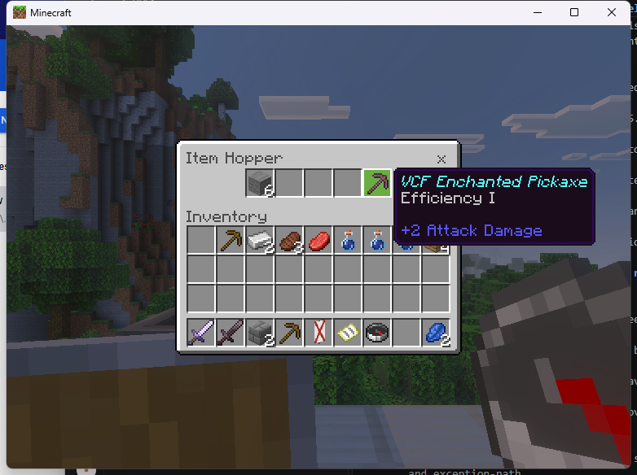
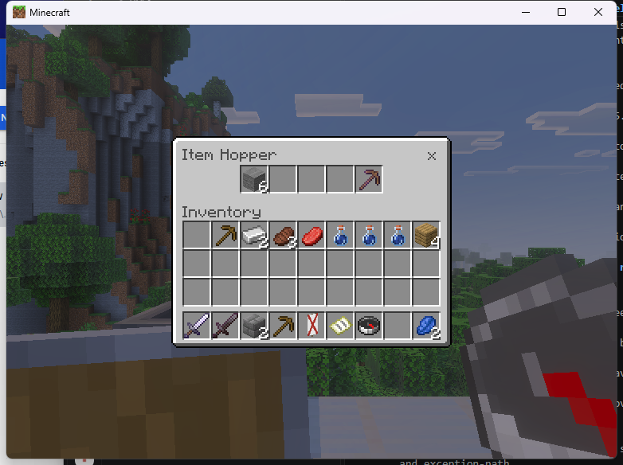
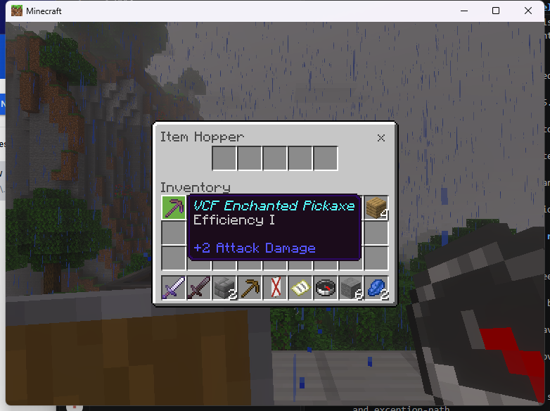
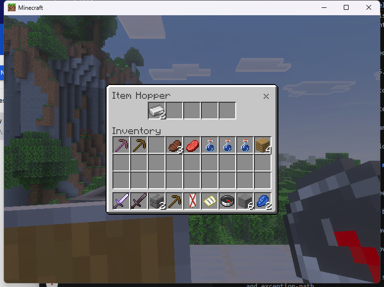
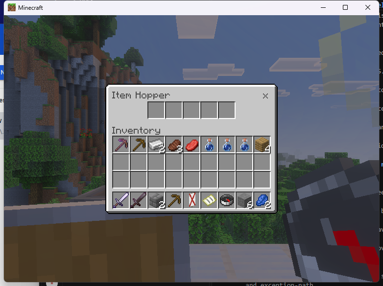

# Linked hopper SDK example

The experimental Linux adapter accepts `hopper` with `VCF_REAL_SOURCE` on the
exact admitted Endstone 0.11.10 / BDS 1.26.45.1 runtime. It uses the real hopper's
five slots. BDS owns its items, normal transfers and world automation. Custom
routing, virtual inventories and Windows admission remain incomplete.
The exact `9a656e3` stock-PC run passed selected transfers, metadata retention,
SDK/native closure and permission/source-loss cleanup. This remains development
evidence, with custom behavior and full lifecycle qualification incomplete.

Install the provider and native passthrough consumer using the
[Linux setup](linux-native-workstations.md#install-and-open). Enable
`experimental_original_linux`, then supply an existing authorized hopper within
six blocks in an already loaded chunk. Keep the literal coordinate quotes:

```text
/vcf_native hopper "4,91,8"
/vcf_native close
```

An independent native consumer uses the installed
[CMake SDK dependency](../NATIVE_SDK.md#use-the-installed-cmake-package):

```cpp
auto request = oni::vcf::sdk::descriptor<vcf_session_desc>();
request.player = oni::vcf::sdk::view(player_uuid);
request.canonical_id = oni::vcf::sdk::view("hopper");
request.mode = VCF_REAL_SOURCE;
request.dimension = oni::vcf::sdk::view(dimension_name);
request.x = source_x;
request.y = source_y;
request.z = source_z;
request.source_permission = oni::vcf::sdk::view("myplugin.hopper");
request.callback = on_session_event;
request.context = this;
vcf_handle ticket = 0;
oni::vcf::sdk::checked(ui.api().prepare(ui.owner(), &request, &ticket));
ui.open(ticket);
```

The consumer registers its permission and callback, checks capabilities, and
forgets its terminal tickets. The player needs the original catalog permission
as well as the consumer's source permission. The provider rechecks permission,
source identity, distance and dimension during the active session. Changed slot
policies, preloaded items or custom rules are refused for this original mode.

The [Linux ABI record](../../research/native-evidence/linux-linked-hopper-abi-126451.json)
identifies a distinct two-pointer block factory and a separately compiled native
container refresh virtual method. The provider verifies the created manager and
its source, sends the open packet, rechecks ownership, then asks BDS to publish
its current contents. An observed matching five-slot content packet is required
before the SDK opening event. Hopper minecarts use a different factory and are
not admitted by this block-source path.

## Stock-client test evidence

The [exact runtime record](../../research/native-evidence/linux-9a656e3-hopper-smoke.json)
identifies the source, loaded provider, both independent consumers and all CI
artifacts. No private diagnostic plugin was installed. The hopper was placed
in air above a verified iron support, with no downstream inventory.

Ordinary-click placed a named Efficiency I pickaxe into the last slot and
Shift-click placed six stone into the first. SDK closure completed, and
reopening rendered both retained stacks. Shift-click recovered the stone;
ordinary withdrawal recovered the pickaxe with its name and enchantment.
Read-only counts confirmed six stone and three total test pickaxes.





Two ingots remained stored during intentional permission loss. Restoring access
allowed reopening and Shift-click recovery of both ingots. Removing the then
verified-empty source closed its session; recreating it in air allowed another
opening and native X closure. A request aimed at a brewing stand refused before
opening.




Four hopper openings and empty beacon/crafter close regressions produced six
opens, four normal closes and three expected denials (two active denials and
one pre-open refusal). The SDK form callback passed; no tickets or provider
sessions remained at clean shutdown. All three Linux CI binaries matched the
local exports, with 14 native/sanitizer tests and 300,000 fuzz inputs passing.
Windows DLLs passed their build checks but have no client qualification here.

World suction, redstone and downstream routing were not tested. Custom policies,
virtual storage, unrestricted remote access, adversarial lifecycle and crash/save
recovery remain incomplete. These selected checks do not upgrade full-catalog
acceptance.
