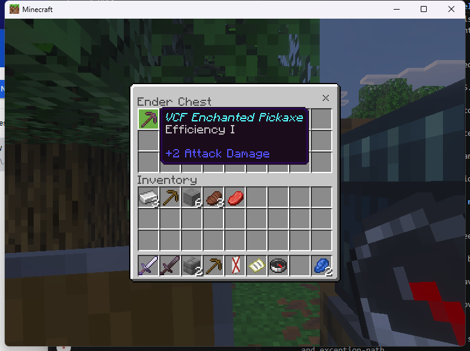
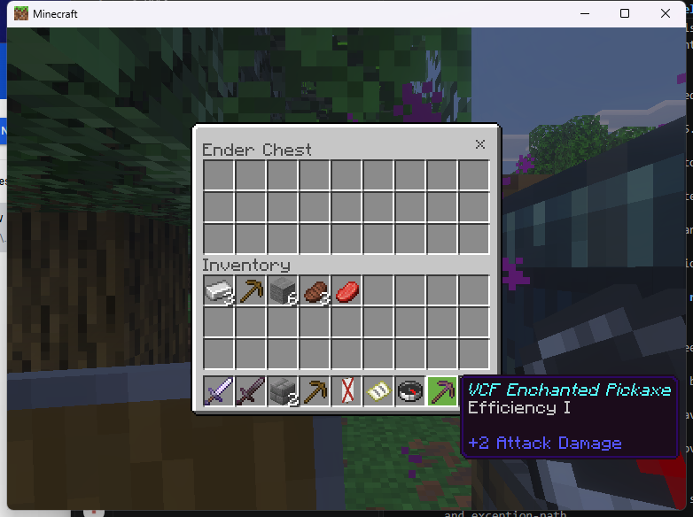
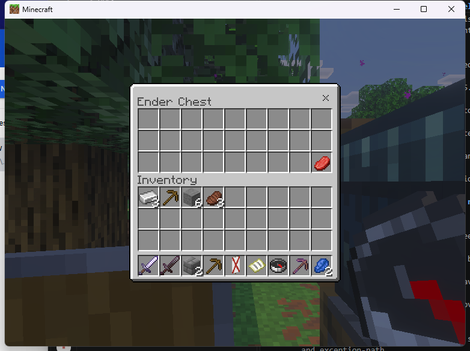
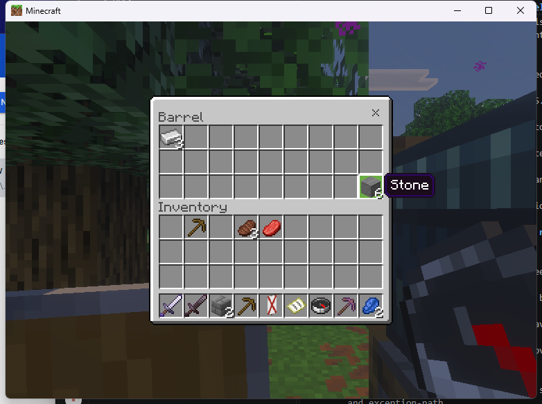
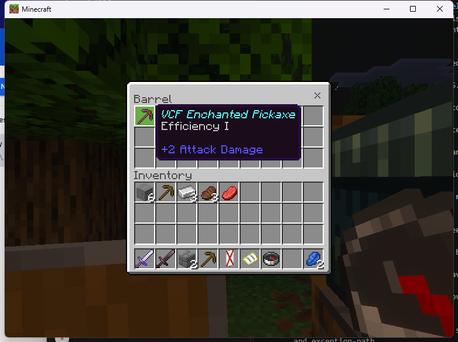

# Linked Ender Chest and barrel SDK example

The experimental Linux adapter accepts `enderchest` and `barrel` using
`VCF_REAL_SOURCE`. Both require an authorized existing matching block within
six blocks, in the player's current dimension and an already loaded chunk.
The Ender Chest screen accesses that online player's actual Ender inventory.
The barrel accesses its actual block inventory. BDS owns their item transfers.

Enable `experimental_original_linux` and install the provider and independent
native passthrough consumer as in the [workstation setup](linux-native-workstations.md).
Only the exact admitted Endstone 0.11.10 / BDS 1.26.45.1 Linux fixture is accepted.
Selected stock-PC transfers and cleanup passed on the exact `1d88dfa` build.
Full storage and all-catalog qualification remain incomplete.

```text
/vcf_native enderchest "2,82,5"
/vcf_native barrel "2,82,7"
/vcf_native close
```

Replace these coordinates with your own authorized source; retain the quotes.
The example creates no blocks. Its operator permission is explicit and it
cannot bind these source requests to its source-free compass trigger.

Dependent C++ plugins use the [same copied descriptor and guard contract](linux-linked-furnaces.md#dependent-plugin),
setting `canonical_id` to `enderchest` or `barrel`, `mode` to `VCF_REAL_SOURCE`,
and supplying dimension, position and `source_permission`. Keep callback code
alive until consumer revocation completes and forget terminal tickets.

The [Linux ABI record](../../research/native-evidence/linux-linked-storage-abi-126451.json)
documents the distinct five-argument block factory, native model, source
resolver and independently compiled header signature. The Ender branch resolves
the player's existing inventory. No item conversion, replacement inventory or
virtual-vault substitution occurs. Source identity and permissions are checked
again while the view is active and before item requests.

This nearby linked path does not yet supply source-free Ender access, custom
storage policies, plugin-owned contents, virtual vaults or source-configuration
aliases. Requested custom items, rules, titles or unrelated held/entity sources
refuse. Windows admission, other storage layouts and crash/save recovery remain
incomplete. Native block effects, including barrel opening, remain vanilla.

## Recorded stock-client checks

The [exact smoke record](../../research/native-evidence/linux-1d88dfa-storage-smoke.json)
identifies the provider, runtime, consumer, client and nine reviewed screenshots.

| Entry | Actual transfers | Cleanup checked |
|---|---|---|
| Ender Chest | Named Efficiency I pickaxe in slot 0; two lapis in slot 26; withdrawal through a second real Ender source | SDK and native X close; permission loss; source removal; retained-input recovery |
| Barrel | Three iron ingots in slot 0; six stone in slot 26; exact withdrawal counts | SDK close and reopen; controlled disconnect with the named enchanted pickaxe; recovery and Escape close |




Permission revocation closed the Ender view with one raw beef retained. Restoring
permission and reopening showed that input. Removing the first test Ender Chest
closed its active view; opening the second source still showed the same beef.
It was recovered, and the read-only player count was one. The operator's previous
permission was restored and the removed test block was recreated in air.





A wrong-family barrel request refused before opening. The existing empty furnace
opened and SDK-closed, and the SDK form callback passed. Nine opens ended in
seven normal closes and two active denials, plus one refusal before opening.
All tickets and sessions retired before clean server shutdown. The controlled
disconnect is separate from crash/save recovery, which remains unqualified.
