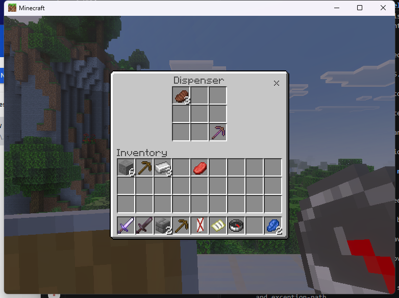
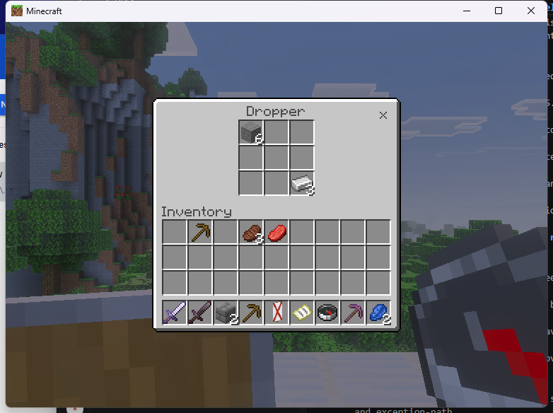
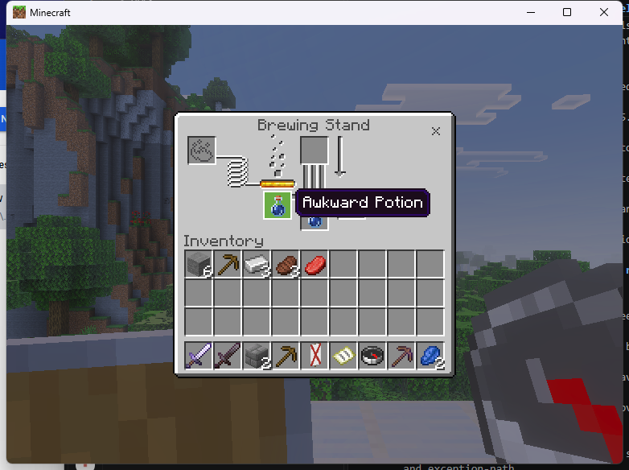
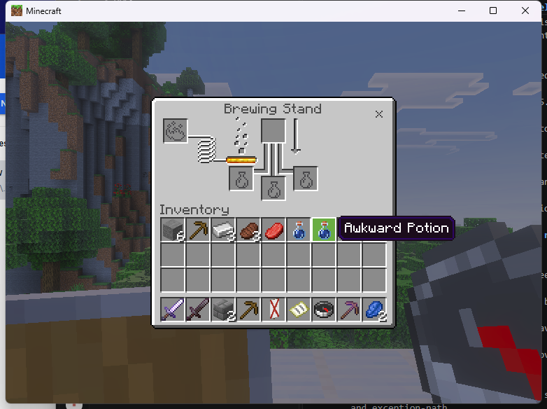
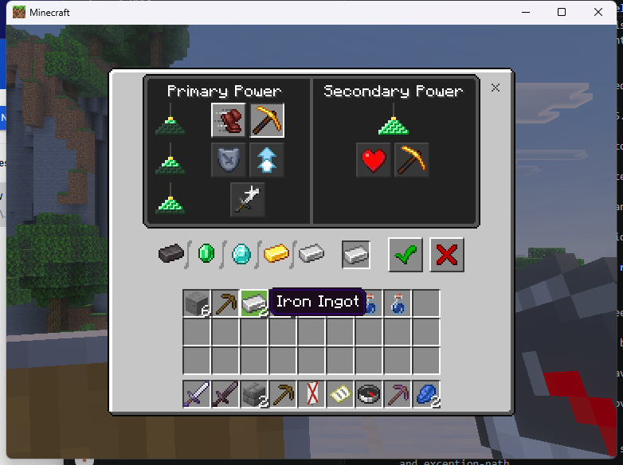
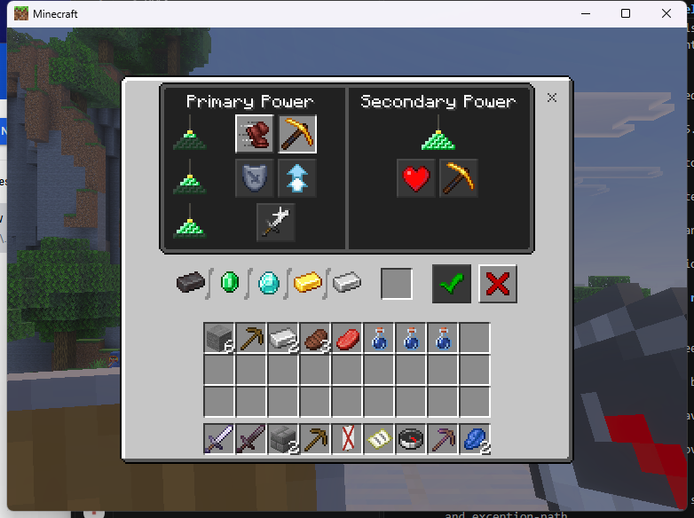
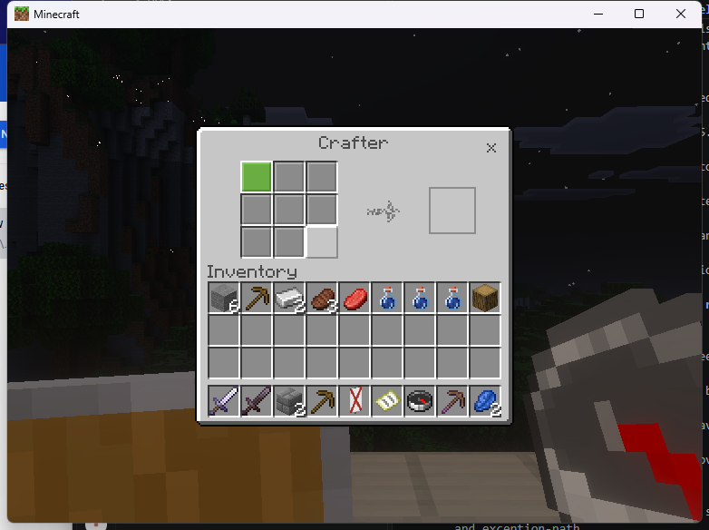
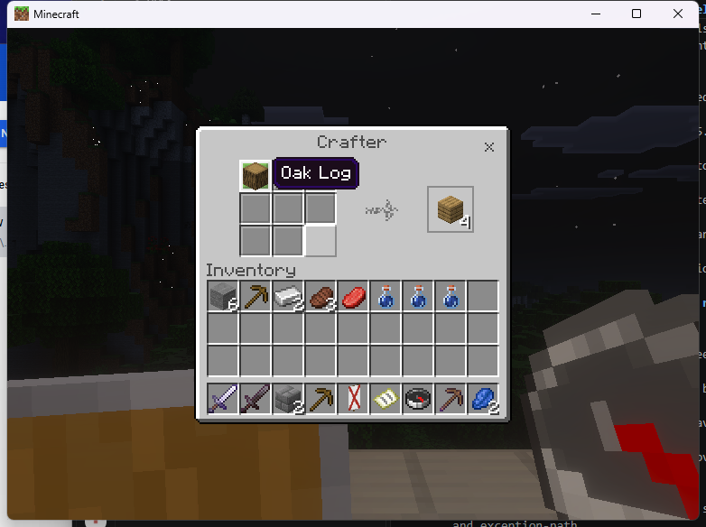
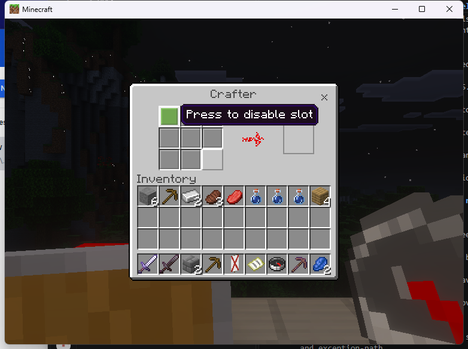

# Linked utility-container SDK examples

The experimental Linux adapter accepts `dispenser`, `dropper`, `brewing`,
`beacon` and `crafter` with `VCF_REAL_SOURCE`. Each has a separate fingerprinted
factory and verified native model identity. The exact `961e9ec` PC run passed
selected transfers, brewing, beacon payment and crafter output. **Beacon and
crafter SDK closure failed**, causing the five-second disconnect quarantine;
normal client closure passed. Windows admission and custom gameplay remain
incomplete. This is experimental development evidence.

Install the provider and native passthrough consumer with the
[Linux setup](linux-native-workstations.md#install-and-open). Enable
`experimental_original_linux` on the exact admitted Endstone 0.11.10 /
BDS 1.26.45.1 fixture. Replace the following positions with your authorized
existing blocks; retain the literal quotes:

```text
/vcf_native dispenser "4,91,3"
/vcf_native dropper "4,91,4"
/vcf_native brewing "4,91,5"
/vcf_native beacon "2,91,5"
/vcf_native crafter "4,91,6"
/vcf_native close
```

Use the [copied SDK source descriptor](linux-linked-furnaces.md#dependent-plugin)
with an explicit dimension, position and source permission. The source must
be within six blocks, in the player's current dimension and a loaded chunk.
Wrong-family, missing or changed sources refuse or close. Consumers must
keep callbacks alive until revocation completes and forget terminal tickets.

These are real block inventories and vanilla behaviors. Brewing uses the
real stand's fuel, bottles and ingredients. A real beacon retains its pyramid,
sky access, payment and world effects. Crafter slot controls affect the real
crafter; crafting requires its ordinary external trigger. Dispenser and dropper
world actions remain subject to native redstone behavior. The example creates
no blocks and does not activate a machine merely to demonstrate a custom API.

Crafter slot-toggle requests for the owned position receive source and
permission checks before BDS processes them. No packet is redirected to another
block. Preloaded custom items, policy changes, recipes, titles and unrelated
held/entity descriptors refuse. Custom processors, routing and source aliases
remain incomplete.

The [Linux ABI manifest](../../research/native-evidence/linux-linked-utility-abi-126451.json)
records the five distinct factory hashes, caller branches and model RTTI.
Hopper has a different context-creation path and is not admitted by these
factories. An original view or successful packet send does not qualify custom
transactions, recovery or the full catalog.

## Actual PC observations

The [exact run and artifact hashes](../../research/native-evidence/linux-961e9ec-utilities-smoke.json)
record ten opens, eight normal closes, two failed SDK closes and one expected
wrong-family refusal. All tickets retired and shutdown completed cleanly.
The [build checkpoint](../../research/native-evidence/checkpoint-961e9ec.json)
records identical local/CI Linux binaries, 14 sanitizer tests and 300,000 fuzz
iterations; those tests do not qualify native gameplay.

Dispenser retained a named Efficiency I pickaxe and three cooked beef across
SDK closure. Dropper retained six stone and three ingots. Both supported
ordinary and Shift-click withdrawals, exact player counts and native closure.
Redstone dispensing/dropping was not tested.




Brewing accepted three water bottles, one blaze powder and one nether wart.
SDK closure during processing succeeded; reopening and withdrawing produced
three awkward potions, including an ordinary-click output and Shift-click outputs.




The real beacon's one-level pyramid enabled Haste. Confirming consumed exactly
one ingot and applied the corresponding HUD effect. Reopening retained the
choice. SDK closure with an unused ingot failed; the quarantine disconnected
the tester. Rejoin returned the unused ingot, restoring the expected two.
This recovery observation does not turn the failed close into a pass.




Crafter toggles for slots 0 and 8 persisted across reconnect. SDK closure failed
and quarantined the tester. After reconnect, re-enabling slot 0 and supplying
one oak log displayed four planks. An actual adjacent redstone trigger consumed
the log and delivered four planks through native world output/pickup. Native
Escape closure passed. The temporary trigger was removed after verification.





These captures are from the stock client; they are not generated mockups.
No private probe was installed during this recorded run. A separate diagnostic
session investigates the failed beacon/crafter close handshake.

## Close-handshake correction under test

The [separate protocol investigation](../../research/native-evidence/linux-beacon-crafter-close-diagnostic.json)
confirmed that packet-only beacon closure was ignored with both tested server
flags. A temporary client-only air update at the owned source caused beacon
and crafter to emit native closure; both real server blocks remained intact.
The adapter now uses that path for these two screens, waits for native readiness,
then restores the current world appearance. Foreign opens or block updates
relinquish its visual ownership. The private probe has been removed.

The [public-plugin test of revision 2c9995e](../../research/native-evidence/linux-2c9995e-close-smoke.json)
closed a beacon and returned one unused payment without disconnecting. Reopening
exposed a regression: payment transfers became unresponsive. This does not
qualify the complete close and restore lifecycle.

The next correction restores native block-entity data as well as block type,
and synchronizes it before opening. Its [independently derived Linux ABI record](../../research/native-evidence/linux-block-actor-update-abi-126451.json)
identifies the beacon/crafter packet generators, native sender and deleting
destructor. The 14 native build tests pass; stock-client repeat-open tests of
this correction remain pending.
