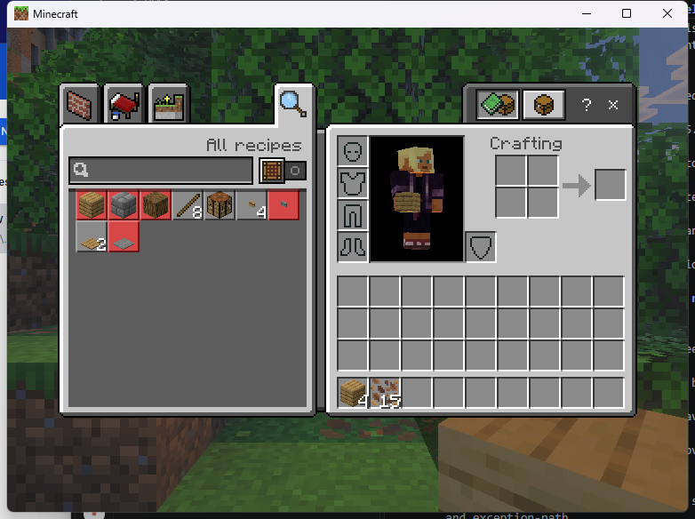
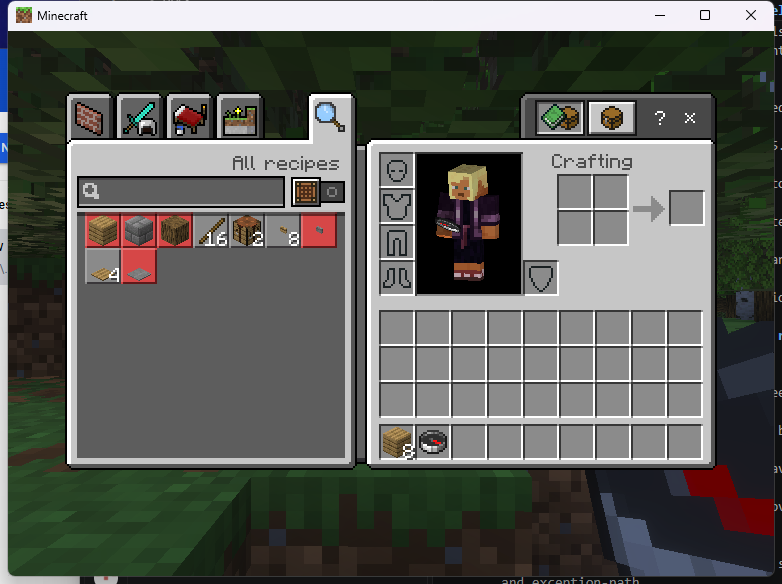
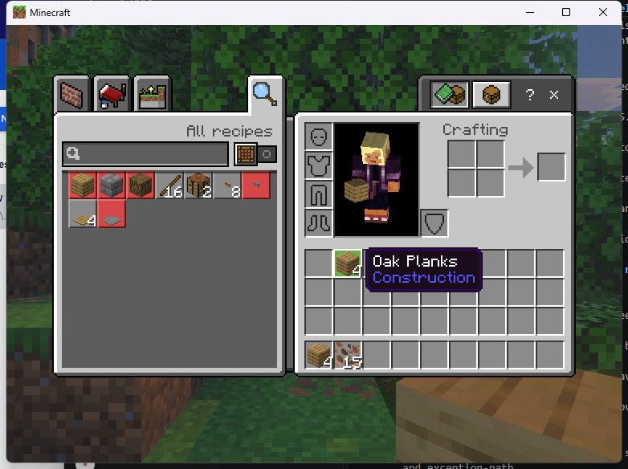
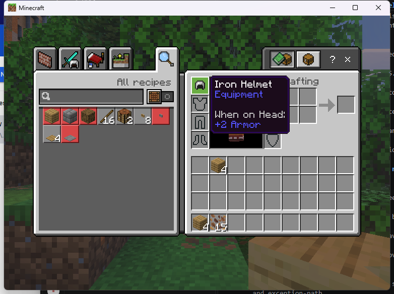
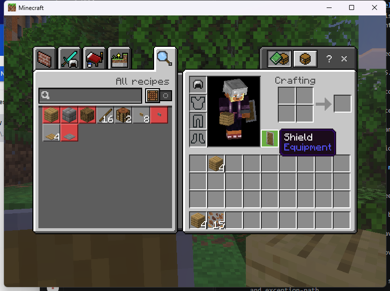
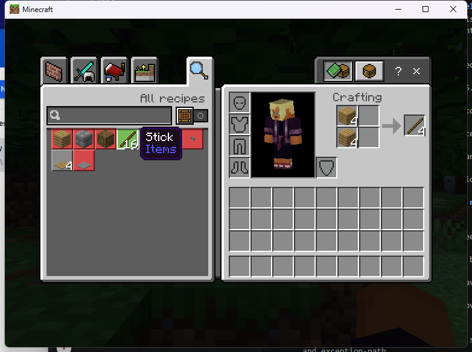

# Open the real inventory from a Linux plugin

The experimental Linux adapter opens the stock player inventory through an
independently verified BDS function. `inventory2x2`, `armor`, `offhand` and
`recipebook` share this screen. The client controls its tabs; these names do
not create four separate layouts.

This is an original-behavior development example. BDS owns the items and
vanilla recipes. Custom recipes, held-container identity and crash recovery
are not completed by this adapter.



## Install the development example

Use the exact [admitted Linux runtime](../NATIVE_LINUX_RUNTIME.md) and a stock
Windows Bedrock 1.26.45 client. Build with
`tools/native/build-linux.ps1` on Windows or `sh tools/native/build-linux.sh`
on Linux. Copy these two artifacts into the isolated server's `plugins/`:

- `dist/linux-x64-dev/plugins/endstone_onistone_vcf.so`
- `dist/linux-x64-dev/examples/endstone_vcf_native_passthrough.so`

In `plugins/onistone_vcf/config.json`, enable the Linux experimental flag:

```json
{
  "schema_version": 1,
  "experimental_original_windows": false,
  "experimental_original_linux": true
}
```

Restart the server. With the example's operator permission, run any of:

```text
/vcf_native inventory2x2
/vcf_native armor
/vcf_native offhand
/vcf_native recipebook
```

Requests wait for the client handshake and chat closure. The SDK reports an
open only after observing the matching native window. Check
`vcf_native status` and `vcf sessions` from the console. Closing with Escape
returns the SDK ticket to terminal state; the example forgets it automatically.

The console command `vcf_native close` cancels this example's owned tickets.
For these real-inventory roles it releases the SDK lease while the player's
inventory stays open. A player running that command addresses only their own
example tickets. No other consumer's handles are affected.

## Use the dependency in your plugin

Declare `depend={"onistone_vcf"}` and include the installed SDK headers.
Keep a `std::unique_ptr<oni::vcf::sdk::Client> ui_` member for your plugin's
lifetime. Initialize it in `onEnable`:

```cpp
ui_ = std::make_unique<oni::vcf::sdk::Client>(
    oni::vcf::sdk::discover(), "my_plugin");
```

From a permitted player's command or interaction callback, on the server thread:

```cpp
auto capability = ui_->capability(ui_->resolve("inventory2x2"));
if (!capability.native_available) return;
auto ticket = ui_->prepare(player.getUniqueId().str(),
                           "inventory2x2", VCF_REAL_SOURCE);
ui_->open(ticket);
// Retain ticket, observe ui_->info(ticket), and forget it after VCF_TERMINAL.
```

Capability availability describes the enabled adapter, not completed release
qualification. Keep the returned ticket until terminal and call `dispose()`
in `onDisable`. For lifecycle callbacks, source permissions, protection guards
and complete cleanup code, use the compiled
[independent consumer](../../examples/native/native_passthrough.cpp).
The [SDK guide](../NATIVE_SDK.md) documents the C ABI and ownership rules.

The example also demonstrates an item-trigger hook:

```text
/vcf_native bind inventory2x2
```

Hold a compass, sneak and right-click to open the inventory. Clear the binding
with `/vcf_native unbind`. This is an ordinary interaction binding, with no
persistent item identity or plugin-owned compass contents.



## What the client tests demonstrate

Source `171e0aa08b67404e26c71a5060c545699a73ce63` completed eight SDK opens
and eight closes, zero failure callbacks and zero outstanding tickets.
The loaded Linux provider matches the exported artifact byte for byte.

| Native behavior | Observed result |
|---|---|
| 2x2 crafting | One test oak log produced four planks; server total increased from four to eight. |
| Armor | A test iron helmet moved into the head slot and remained equipped on reopening. |
| Offhand | A test shield moved into the offhand slot and remained equipped on reopening. |
| Recipe book | The stock stick recipe populated the 2x2 grid. |
| SDK cancellation | Ticket closed and forgotten while the stock inventory stayed usable. |
| Controlled disconnect | On Peaceful difficulty, eight planks left in the grid were present after reconnect; the normal E-key control also preserved eight. |
| SDK forms | The independent action form still dispatched once and returned to zero tickets. |









An earlier disconnect check returned no planks after reconnect and was followed
by a zombie death. That failed observation remains in the test record; the
later controlled pass does not explain it or qualify death/drop conservation.
Forged requests, stale closes, multiplayer, other input devices, hot-disable
reentrancy and crash/save recovery remain unqualified. Preloads, replacement
titles, custom rules and alternative backing modes explicitly refuse.

See the [exact smoke record](../../research/native-evidence/linux-171e0aa-inventory-smoke.json),
[redacted counters](../../research/native-evidence/linux-171e0aa-inventory-counters.txt)
and [build identities](../../research/native-evidence/checkpoint-171e0aa.json).
These are development results; the full-catalog release gate remains closed.
