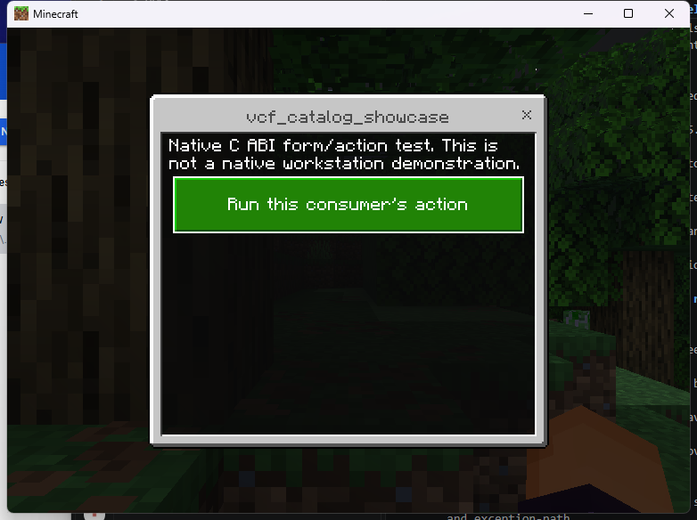
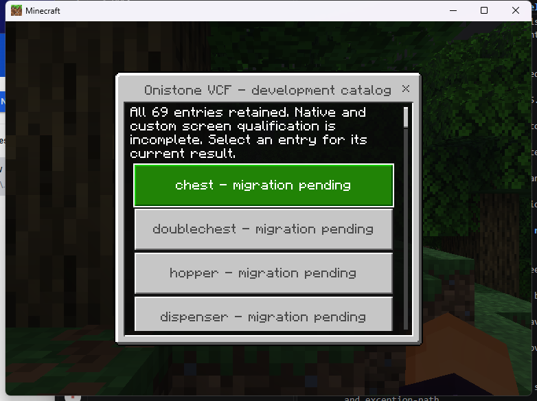

# Linux native SDK example

This example demonstrates the native provider's ordinary action form and ticket
lifecycle. It is a development build; native workstation customization remains
incomplete. The stock client needs no project resource pack for this form.

Build with `tools/native/build-linux.ps1` on Windows Docker Desktop, or
`tools/native/build-linux.sh` on Linux. The export contains:

- `plugins/endstone_onistone_vcf.so`: provider.
- `examples/endstone_vcf_catalog_showcase.so`: independent C++ SDK consumer.
- `examples/endstone_vcf_native_passthrough.so`: original-mode request example;
  selected original modes are available behind the Linux opt-in flag. See the
  [workstation example](linux-native-workstations.md) for exact coverage.
- `sdk/include/oni/vcf/`: C ABI, C++ wrapper and provider discovery headers.

Use the exact admitted runtime and library environment documented in
[Linux runtime development](../NATIVE_LINUX_RUNTIME.md). Stop the isolated
server, copy the provider and desired consumers into `plugins/`, and restart.
Do not install the legacy RemoteWorkstations wheel in the same server.
Native plugin replacement requires a process restart.

Join the test server from Minecraft and run `/vcf_catalog_showcase`. Click
**Run this consumer's action**. From the server console, run
`vcf_catalog_showcase` and `vcf sessions`: the callback count increases once,
and outstanding tickets and provider sessions return to zero. Reopen the form
and close with X: the callback count stays unchanged and the ticket is collected.

Run `/vcf` to inspect the retained catalog. Its entries report their current
unavailable native/custom adapters; selecting an entry is not evidence that its
workstation has been implemented.

The [compiled consumer source](../../examples/native/consumer.cpp) demonstrates
provider discovery, `register_action`, `show_menu`, `session_info`, `forget`
and consumer disposal. It declares `depend = {"onistone_vcf"}`. A selected
button's action result belongs to the original menu ticket. Its scheduler
collects terminal tickets; consumers must manage their own completed handles.
See the [SDK contract](../NATIVE_SDK.md) for ownership and callback restrictions.

These screenshots and the [redacted smoke record](../../research/native-evidence/linux-0a91902-client-smoke.json)
apply to source `0a91902` and Linux provider SHA-256
`65a22206e359e0aaf2565f20e7291408486051553e05e5525aa9e51b5eecac12`.
They show a stock Windows PC 1.26.45 client, protocol 2169, keyboard/mouse.
The smoke record includes action, close and disconnect cleanup. It does not
qualify the complete forms API or any native workstation transaction.
