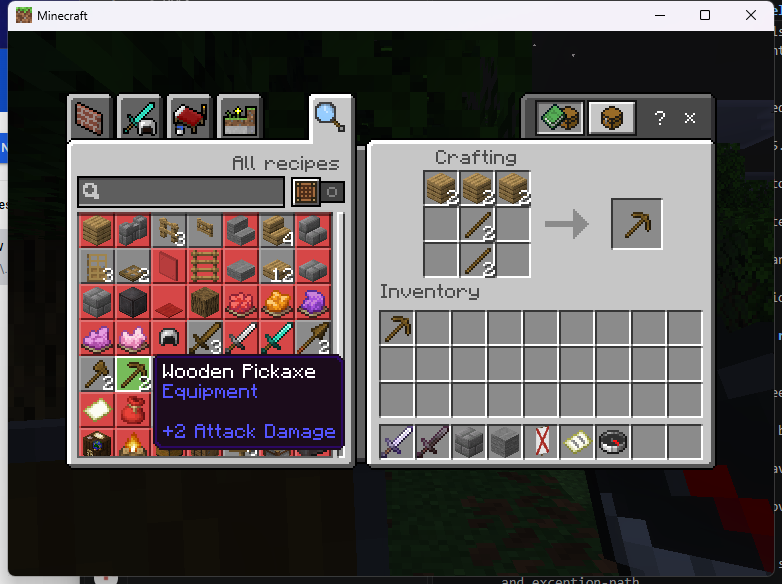
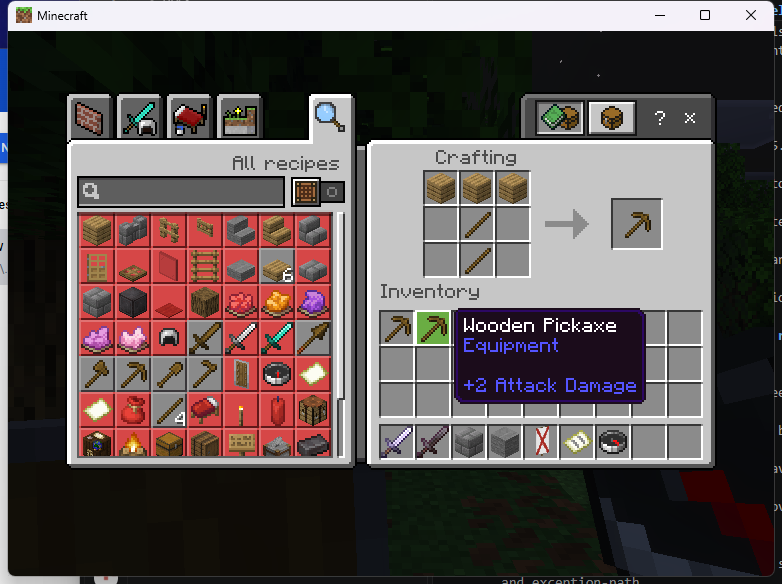
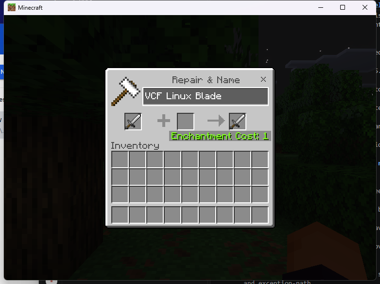
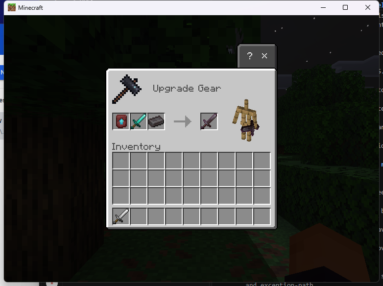
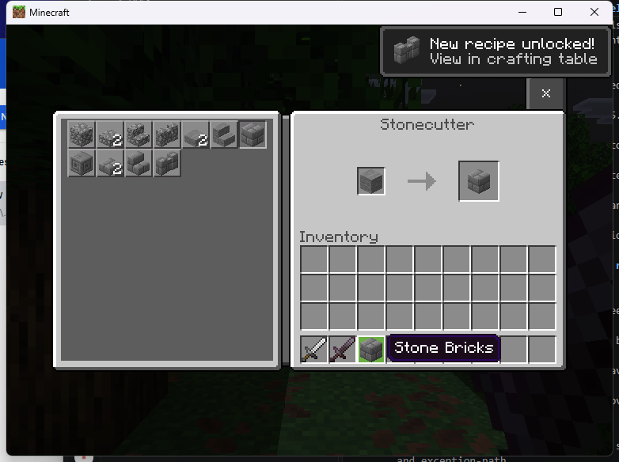
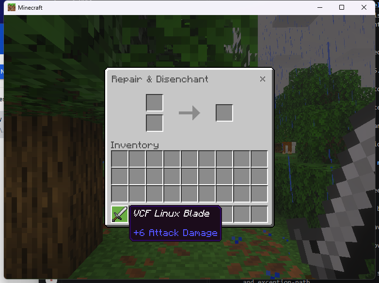
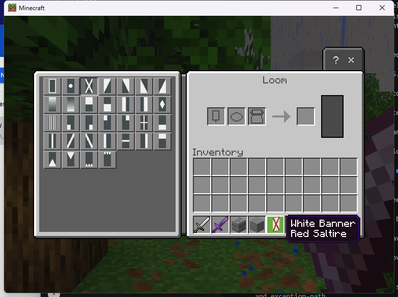
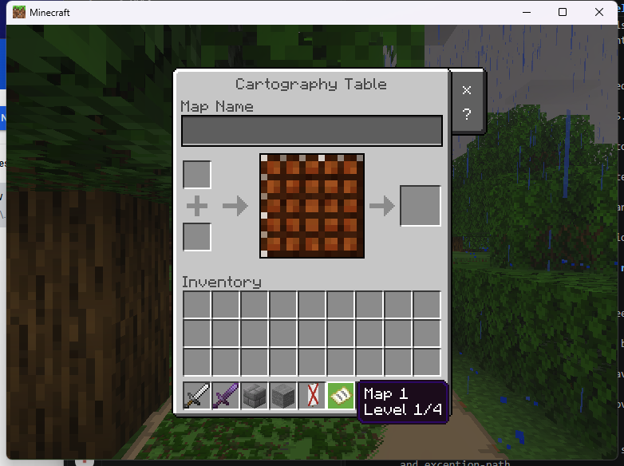
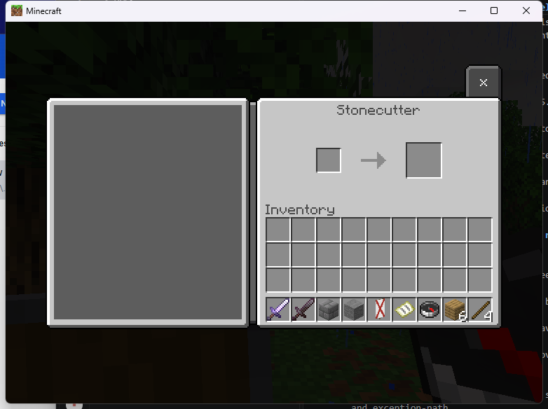

# Native workstation SDK example on Linux

The experimental Linux adapter opens **crafting, anvil, smithing, stonecutter,
grindstone, loom and cartography** through the native C++ SDK. The screenshots below come
from a stock Windows Bedrock 1.26.45 client connected to the isolated Linux
Endstone 0.11.10 / BDS 1.26.45.1 server.

These are original-gameplay contexts: BDS owns the ingredients, recipes, costs
and outputs. Custom recipes, editable virtual contents and transaction callbacks
remain incomplete. The full-catalog release gate remains **NOT QUALIFIED**.

## Install and open

1. Follow [the Linux build instructions](../NATIVE_BUILDING.md). Copy
   `dist/linux-x64-dev/plugins/endstone_onistone_vcf.so` and
   `dist/linux-x64-dev/examples/endstone_vcf_native_passthrough.so` into the
   isolated server's `plugins` directory. No project wheel is required.
2. After the provider creates its configuration, stop the server and set
   `experimental_original_linux` to `true` in
   `plugins/onistone_vcf/config.json`. Restart using the
   [exact admitted runtime files](../NATIVE_LINUX_RUNTIME.md).
3. Join with Windows Bedrock 1.26.45. The tester needs
   `remoteworkstations.use`, `remoteworkstations.open.<entry>` and
   `vcf.examples.passthrough`. The example's permission defaults to operator.
4. Run `/vcf_native anvil`, or choose another entry below.

| Command | Original operation observed in the linked smoke records |
|---|---|
| `/vcf_native craft` | 3×3 pickaxe recipe, ordinary/Shift-click output, unused-input return and ingredient reconnect |
| `/vcf_native anvil` | Rename, one-level cost and sword delivery |
| `/vcf_native smithing` | Netherite upgrade with template and ingredient consumption |
| `/vcf_native stonecutter` | Stone-brick selection, output and unused-input return |
| `/vcf_native grindstone` | Disenchantment and name retention; an initial rejected output remains unresolved |
| `/vcf_native loom` | Red saltire selection and patterned-banner delivery |
| `/vcf_native cartography` | Map expansion to level 1/4 and paper consumption |

The four shared inventory roles use the [real-inventory example](linux-native-inventory.md).
Other catalog entries retain their individual [matrix results](../CAPABILITY_MATRIX.md).

## Three-by-three crafting

Source `7aacb36` adds the independently verified Linux crafting context.
Run `/vcf_native craft`, or use the preserved `/workbench` alias. For a player
interaction, run `/vcf_native bind craft`, hold a compass, then sneak and
right-click. The dependency request is the same as the example below with
canonical ID `craft` and `VCF_NATIVE_CONTEXT`.



An ordinary click delivered one pickaxe. SDK closure returned the remaining
three planks and two sticks. Those ingredients also survived a controlled
disconnect with the recipe still in the grid. Reopening through `/workbench`
and Shift-clicking delivered the second pickaxe and consumed the ingredients.



The [exact crafting smoke record](../../research/native-evidence/linux-7aacb36-crafting-smoke.json)
identifies the provider, client, counters and five screenshots. It also records
stonecutter, shared-inventory and form regressions. The six workstation
screenshots below retain their separate `ca30255` evidence. Neither run
qualifies custom recipes, custom inventory writes or crash/save recovery.

## Use the provider as a dependency

Declare `depend = {"onistone_vcf"}` in your Endstone plugin registration.
Create one persistent `sdk::Client` during enable using `sdk::discover()`.
From a server-thread command, event or scheduled callback, request a workstation:

```cpp
#include <oni/vcf/sdk.hpp>
#include <oni/vcf/loader.hpp>
#include <endstone/player.h>

namespace sdk = oni::vcf::sdk;

vcf_handle openAnvil(sdk::Client& ui, endstone::Player& player) {
    auto capability = ui.capability(ui.resolve("anvil"));
    if (!capability.native_available)
        throw std::runtime_error("The native anvil adapter is unavailable.");

    auto ticket = ui.prepare(player.getUniqueId().str(), "anvil",
                             VCF_NATIVE_CONTEXT);
    ui.open(ticket);
    return ticket;
}
```

Store the ticket, observe its asynchronous state, and forget it after it becomes
terminal. The [compiled consumer](../../examples/native/native_passthrough.cpp)
demonstrates callbacks, guards, permission checks and scheduled cleanup. Its
`vcf_native close` command closes only that consumer's tickets; a player issuing
the command addresses only their own tickets. `vcf_native status` reports opens,
closes, failure callbacks and outstanding tickets.

The six workstation contexts reject preloaded slots, replacement titles, custom
rules and source descriptors. Use the [SDK contract](../NATIVE_SDK.md) to distinguish
currently callable operations from planned custom services. A successful open
callback does not prove that a later native transaction succeeded.

## Actual client observations

**Anvil:** the iron sword was renamed to `VCF Linux Blade`, delivered to inventory,
and charged one level. The server's count query confirmed one sword.



**Smithing:** one template, diamond sword and netherite ingot produced one
netherite sword. Server count queries confirmed the output and consumed inputs.



**Stonecutter:** selecting stone bricks consumed one of two stone. SDK closure
returned the unused stone. A later disconnect with one stone still in the input
also returned that stone after reconnecting.



**Grindstone:** Shift-click removed Sharpness I from the named iron sword and
Unbreaking I from the netherite sword. Later plain-click repetitions succeeded
on both. The custom name remained and the XP bar visibly increased; exact XP,
curse retention and repair combinations are unqualified.

The first plain-click attempt displayed the result but did not deliver it.
The enchanted input returned on close. That
[failed attempt](../images/native-linux-workstations/grindstone-initial-rejection.png)
remains unresolved; successful repetitions do not establish its cause or a fix.



**Loom:** a white banner and red dye produced a white banner with Red Saltire
metadata. The dye was consumed and the banner remained in inventory.



**Cartography:** a vanilla map and one paper produced Map 1 at level 1/4.
This tests vanilla expansion; custom map printing and MapProvider integration
remain separate required work.



## Open from a held-item interaction

Run `/vcf_native bind stonecutter`, hold an ordinary compass, then sneak and
right-click. The independent consumer receives Endstone's public interaction
event and requests the same native SDK context. `/vcf_native unbind` clears the
binding; disconnect also clears it.



This demonstrates an event-triggered opening. It does not implement persistent
held-container identity, bundle storage or item-bound recovery.

## Evidence and limits

The [exact smoke record](../../research/native-evidence/linux-ca30255-workstation-smoke.json)
identifies source `ca3025524ff754f87a66df4dec4756c964855d82`, provider SHA-256
`ccc60ce2cf6e837e2ab550fa70bc646a18cc7d23dff4da8a3b9091d53c9b8963`, both
independent consumers and the reviewed screenshot hashes. The run ended with
15 opens, 15 closes, zero failure callbacks and zero outstanding tickets.
The separate SDK form action passed, and the server shut down cleanly.

Inventory regressions included equipment persistence and a recipe-book
disconnect with six unused planks and four crafted sticks retained on rejoin.
The [Linux ABI manifest](../../research/native-evidence/linux-native-workstations-abi-126451.json)
records independently compiled header layouts and complete function hashes.

This is a development smoke test. It does not qualify custom transactions,
all recipe combinations, hostile/replayed requests, competing plugins, death/drop
conservation, provider hot-disable or BDS/player crash recovery. Only the stated
PC client was tested; Windows server evidence remains separate.
